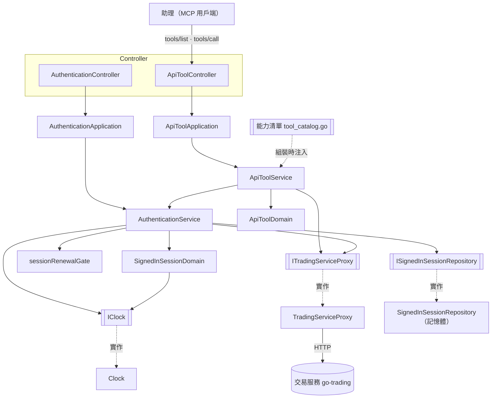
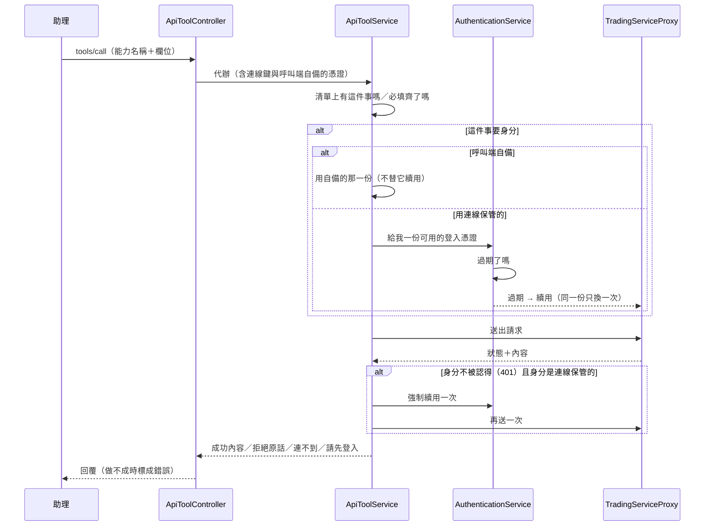

# 交易助理外掛 — Architecture Design

**Status:** Confirmed
**Source PRD:** `.sdd/2026-09-17-trading-assistant-connector/PRD.md`
**Tech context:** Go 1.26 · Clean / Onion Architecture · MCP over Streamable HTTP（`github.com/modelcontextprotocol/go-sdk`）· 無資料庫

---

## 1. Design Goal & Guiding Principle

- **In one sentence**
  交易服務對外開放的每一件事，都成為助理呼叫得到的一個 MCP tool；外掛只負責**保管身分**與**轉達**，一條業務規則都不重述。

- **Guiding principle**
  **能力是資料，不是程式碼。** 每一件事寫成 `ApiToolDomain` 的一列宣告（名稱、說明、動詞、路徑樣板、欄位落點、要不要身分），由**同一段**流程執行。因此「交易服務新增一件事」＝ 在 `cmd/server/tool_catalog.go` 補一列，**不新增 handler、不改 service、不改 controller**。五十幾件事若各寫一支 handler，就是五十幾個可以各自寫錯的地方，而它們做的其實是同一件事。

  次要原則：**所有「怎麼跟交易服務說話」的細節（含即時更新那條持續連線）都關在 `TradingServiceProxy` 裡**，domain 拿到的一律是「送出一個請求、收回一個回應」這一種形狀。

---

## 2. Change Scope

這是一個全新專案，`.claude/rules/` 之外沒有既有程式碼。

| Area | Action | What / Why |
| :--- | :--- | :--- |
| `cmd/server/` | **Add** | 進入點、設定讀取、手動 DI、**能力清單**（唯一列出五十幾件事的地方） |
| `internal/domain/models/domains/` | **Add** | `ApiToolDomain`（一件能力怎麼變成一個請求）、`SignedInSessionDomain`（一份身分還能不能用） |
| `internal/domain/models/vo/` | **Add** | 能力欄位、請求、回應、憑證對、連線鍵等不可變值 |
| `internal/domain/models/dto/` | **Add** | domain 對 application 的回傳形狀 |
| `internal/domain/service/` | **Add** | `ApiToolService`（代辦一件事）、`AuthenticationService`（保管與續用身分）、`sessionRenewalGate`（讓一份續用憑證只被換一次的機制） |
| `internal/domain/interface/` | **Add** | `ITradingServiceProxy`、`ISignedInSessionRepository`、`IClock` |
| `internal/application/` | **Add** | `ApiToolApplication`、`AuthenticationApplication` |
| `internal/controller/` | **Add** | `ApiToolController`、`AuthenticationController`——只做 MCP 請求／回應轉換 |
| `internal/infrastructure/` | **Add** | `TradingServiceProxy`、`SignedInSessionRepository`（記憶體）、`Clock` |
| `internal/domain/models/entities/` | **Not created** | 外掛沒有資料庫。沒有東西要持久化，就沒有 entity——建一個空資料夾只會讓人以為漏了什麼 |
| 交易服務（`go-trading`） | **Not touched** | 業務規則的唯一擁有者。外掛一行都不改它 |
| 背景工作 | **Not created** | 外掛沒有任何自己要定時做的事 |

---

## 3. New Classes / Modules

| Name | Kind | Responsibility (purpose) | Collaborators | Satisfies (PRD scenario) |
| :--- | :--- | :--- | :--- | :--- |
| `ApiToolDomain` | Domain Model | 一件能力**怎麼變成一個給交易服務的請求**：套路徑樣板、分配欄位到查詢字串或內文、檢查必填、說出自己的輸入形狀與要不要身分 | `ToolParameterVo`、`ToolArgumentsVo` | US-09 全部、US-07 少必填欄位 |
| `SignedInSessionDomain` | Domain Model | 一份身分**還能不能用**：登入是否過期、續用是否還在、換到新憑證之後長什麼樣 | `TokenPairVo`、`IClock` | US-03 全部、US-01 換帳號 |
| `ToolParameterVo` | VO | 一格欄位：名字、型別、說明、必不必填、**放到哪裡**（path / query / body） | — | US-09 每件事說得出要填什麼 |
| `ToolArgumentsVo` | VO | 助理這次填進來的那些格子（名稱 → 一段 JSON）。提供「取這一格」「除了這些之外還剩哪些」 | — | US-09 |
| `ToolInputSchemaVo` | VO | 一件能力的輸入形狀，由 `ApiToolDomain` 依欄位算出來 | `ToolParameterVo` | US-09 |
| `TradingServiceRequestVo` | VO | 要送給交易服務的一個請求：動詞、路徑、查詢字串、內文、要不要帶身分、**即時更新等待上限**（為零表示一般請求） | — | 全部 |
| `TradingServiceResponseVo` | VO | 交易服務回了什麼：狀態、內容 | — | US-07 全部 |
| `TokenPairVo` | VO | 一對憑證與各自的到期時刻 | — | US-01、US-03 |
| `SessionKeyVo` | VO | 一個連線的身分保管位置 | — | US-05 |
| `LiveUpdatePeekVo` | VO | 看一眼即時更新的條件：哪一檔、最長等多久 | — | US-08 |
| `ApiToolService` | Domain Service | **代辦一件事**：找出能力、取得可用身分、組出請求、送出、把結果或拒絕原因帶回。401 時續用一次再重試 | `AuthenticationService`、`ITradingServiceProxy`、`ApiToolDomain` | US-02、US-06、US-07、US-08、US-09 |
| `AuthenticationService` | Domain Service | **保管身分**：登入、登出、交出一份可用的登入憑證（過期就自己續用）、強制續用一次 | `ITradingServiceProxy`、`ISignedInSessionRepository`、`IClock`、`sessionRenewalGate` | US-01、US-03、US-04、US-05 |
| `sessionRenewalGate` | 機制（住在 service 旁） | 讓**同一個連線同時撞上過期時，那份續用憑證只被換一次**，其餘等這一次的結果 | `SessionKeyVo` | US-03 同一份續用不會被換兩次 |
| `ITradingServiceProxy` | 介面 | 跟交易服務說話的唯一出口：送一個請求、收一個回應（**即時更新那條持續連線也收在這裡面**） | — | US-07、US-08 |
| `ISignedInSessionRepository` | 介面 | 一個連線的身分存在哪、讀得回來、清得掉 | — | US-01、US-04、US-05 |
| `IClock` | 介面 | 現在幾點。讓「過期了沒」測得出來 | — | US-03 |
| `ApiToolApplication` | Application | 用例編排：列出會做的事、代辦一件事 | `ApiToolService` | US-02、US-07、US-08、US-09 |
| `AuthenticationApplication` | Application | 用例編排：登入、登出、強制續用 | `AuthenticationService` | US-01、US-03、US-04 |
| `ApiToolController` | Controller | 把 MCP 的一次 tool 呼叫轉成用例輸入，把結果轉回 MCP 的回覆 | `ApiToolApplication` | 全部 |
| `AuthenticationController` | Controller | 登入／登出／續用這三件**外掛自己做**的事的 MCP 轉換 | `AuthenticationApplication` | US-01、US-03、US-04 |
| `TradingServiceProxy` | Proxy | 真的去打交易服務：組網址、帶身分、讀回應；等待上限不為零時改走持續連線、收到第一則或等滿即收線 | — | US-07、US-08 |
| `SignedInSessionRepository` | Repository | 把身分放在記憶體裡，以連線為鍵，讀寫加鎖 | — | US-05 |
| `Clock` | — | 系統時鐘 | — | US-03 |

### 為什麼 `ApiToolDomain` 是深的

呼叫端只說一句 `apiTool.BuildRequest(arguments)`，就拿到一個可以直接送出的請求。藏在裡面的是：路徑樣板上的每一格怎麼填、哪些欄位進查詢字串、剩下的怎麼組成內文、必填的少了要怎麼講。**呼叫端不必依序做四件事**，而且新增一件能力不會讓這個介面多一個參數。

### 為什麼即時更新不在 domain 分岔

「看一眼」與「問一句」對 domain 而言是同一件事：**送一個請求、收一個回應**。差別只在「那條線要開多久、收到什麼算收完」——那是**怎麼說話**，不是**說什麼**，所以它整個關在 `TradingServiceProxy` 裡。domain 只在請求上寫一個等待上限，其餘一無所知。少掉的那個分岔，就是少一個以後會忘記同步的地方。

---

## 4. Modified Components

無。全新專案。

---

## 5. Component Relationships

### 代辦一件事的流程

---

## 6. Extensibility & Handoff Notes

- **Most likely next requirement:** 交易服務新增一個端點（或改掉一個欄位）。
- **Where it lands:** `cmd/server/tool_catalog.go` 的能力清單。
- **How to add it:** 補一個 `ApiToolDomain`：名稱、給助理看的說明、動詞、路徑樣板、欄位與各自的落點、要不要身分。**不新增 handler、不改 service、不改 controller、不改 proxy。**
- **第二個可能的變更：換一個後端或多一個後端。** 落點是 `ITradingServiceProxy`——再寫一個實作、組裝根換一行。
- **Patterns applied & why**
  - **宣告式目錄（catalog）取代 handler-per-endpoint**：五十幾件事共用同一段流程，把差異收進資料。
  - **Adapter（`TradingServiceProxy`）**：把「持續連線」與「一般請求」兩種說話方式收成同一種形狀。
  - **Single-flight（`sessionRenewalGate`）**：續用憑證只能用一次，所以並行續用必須收斂成一次。
- **Do not hardcode**
  - 交易服務的網址、請求逾時、即時更新等待上限、服務埠號——全部走設定。
  - 「哪些事要身分」寫在能力清單那一列上，**不寫成 service 裡的 if**。
  - 交易服務的拒絕訊息**原話帶回**，不在外掛翻譯或改寫。
- **Known debt / deferred**
  - 身分只活在記憶體裡，服務重啟即需重新登入。這是刻意的（外掛沒有自己的資料庫）。要改的訊號是：外掛變成多台一起跑，使用者開始抱怨重連就要重登。
  - 沒有速率限制、沒有稽核記錄。訊號是：外掛開始對外開放給本人以外的人用。
  - 只支援一種連線方式（Streamable HTTP）。要加 stdio 時落點是組裝根多掛一個 transport，domain 以下一行不動。

---

## 7. Traceability

| PRD Scenario | Fulfilled by |
| :--- | :--- |
| US-01 電子郵件與密碼對得上 | `AuthenticationService.SignIn` + `SignedInSessionDomain` + `AuthenticationController`（回覆不含憑證） |
| US-01 密碼打錯 / 簽不出登入 | `AuthenticationService.SignIn` + `TradingServiceResponseVo` 原話 |
| US-01 換一個帳號登入 | `SignedInSessionRepository` 以連線鍵覆蓋 |
| US-02 已登入代辦要身分的事 | `ApiToolService.CallApiTool` + `ApiToolDomain.RequiresSignIn` |
| US-02 未登入代辦要身分的事 | `ApiToolService` → `signInRequired` |
| US-02 未登入代辦不需要身分的事 | `ApiToolDomain.RequiresSignIn` 為否 |
| US-03 登入還沒過期 | `SignedInSessionDomain.IsAccessTokenUsable` |
| US-03 過期但續用還有效 | `AuthenticationService.UsableAccessToken` 自動續用 |
| US-03 續用也失效 | `AuthenticationService` → `signInExpired` |
| US-03 換新登入時連不到 | `AuthenticationService` → `tradingServiceUnreachable`（**不**說成請重新登入） |
| US-03 同一份續用不會被換兩次 | `sessionRenewalGate` |
| US-04 登出 / 本來就沒登入 | `AuthenticationService.SignOut` + `SignedInSessionRepository.Clear` |
| US-05 各自的連線各自的身分 | `SessionKeyVo` + `SignedInSessionRepository` |
| US-05 沒登入的連線借不到別人的身分 | 同上 |
| US-06 自備身分 / 優先 / 已失效 | `ApiToolService` 讀 `ToolCallDto.SuppliedAccessToken`，且不替它續用 |
| US-07 原話帶回拒絕原因（五種） | `ApiToolService` + `TradingServiceResponseVo` |
| US-07 整個連不上 | `TradingServiceProxy` → `tradingServiceUnreachable` |
| US-08 看一眼即時更新（三種） | `TradingServiceProxy` 的等待上限收線 + `LiveUpdatePeekVo` |
| US-09 能力清單涵蓋每一件事 | `cmd/server/tool_catalog.go` 的 `apiToolCatalog` |
| US-09 每件事說得出要不要身分與要填什麼 | `ApiToolDomain.ToDefinitionDto` + `ToolInputSchemaVo` |

---

## 8. Risks & Open Decisions

- **Risks / trade-offs**
  - **能力清單是手寫的**，所以它可能與交易服務不同步。換來的是助理看得到**為它寫的說明**——自動產生的清單只會有端點路徑，助理據此挑錯工具的代價遠高於手寫一列。守門的方式是清單的涵蓋度測試（US-09）。
  - **自備身分不替它續用。** 續用憑證不在外掛手上，硬續會拿不到東西。代價是自備身分的人過期時要自己換。
  - **記憶體保管身分**：換來零維運，代價是重啟即失憶。

- **Open decisions（實作時定案）**
  - 即時更新等待上限預設 10 秒、收到第一則即回，兩者皆可設定。
  - 服務埠號預設 `8090`（避開交易服務的 `8080`）；MCP 掛在 `/mcp`。
  - 交易服務網址預設 `http://localhost:8080`，請求逾時預設 30 秒。
