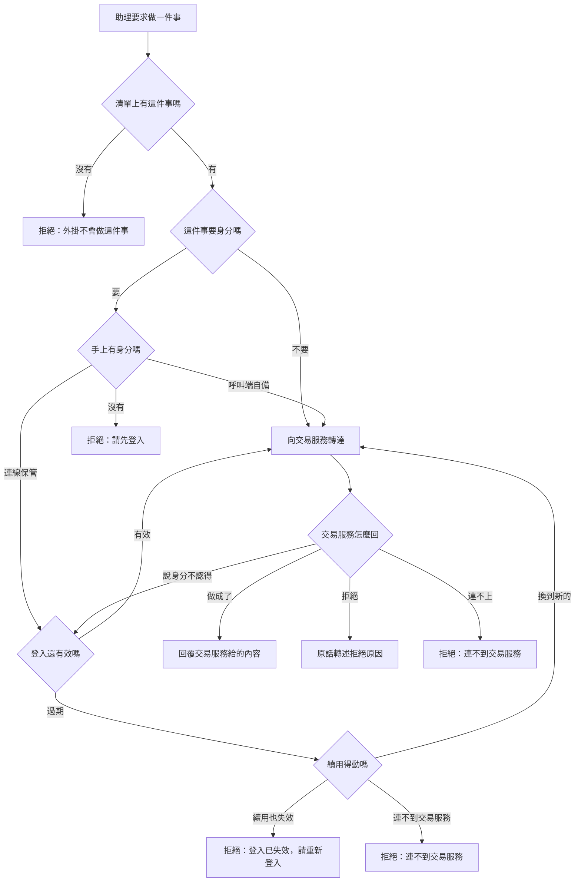

# Product Requirements Document — 交易助理外掛

**Status:** Draft
**Version:** v1.0
**Owner:** James Hsueh
**Stakeholders:** Engineering

---

## 1. Background & Goal

- **Problem Statement**
  交易服務會的事已經很多——存行情、算指標、寫策略腳本、組交易策略、重演一段行情、養一台策略機器人、推通知、跟行情助手對話。但這些全都得由人自己開畫面、自己拼參數、自己記得先登入。使用者在助理裡講一句「幫我把這支均線策略在台積電上重演一次」，助理**什麼都做不到**，只能叫他自己去操作。

- **Expected Outcome**
  交易服務現在對外開放的每一件事，助理都做得到——一件不漏。使用者在助理裡把自己的帳號交出去一次，之後說人話就能操作自己的策略腳本、交易策略、機器人與通知設定，不必再離開對話去點畫面，也不必每次重新登入。

- **Out of Scope**
  - 外掛不自己存行情、不自己算指標、不自己下單。
  - 外掛不改變任何一條業務規則：交易服務拒絕的，外掛不放行；交易服務允許的，外掛不多問。
  - 不做持續推送。即時更新只給「看一眼」，不維持一條永遠開著的通道。
  - 不替使用者記住密碼、不做記住我、不做自動註冊。
  - 外掛沒有自己的資料庫。身分只在服務執行期間記得。

---

## 2. User Personas

- **Primary Role — 交易者本人**
  已經在交易服務有帳號的人。他有自己的策略腳本、交易策略與機器人，在助理的對話框裡工作，一邊想一邊改，隨口說出下一步。

- **Secondary Role — 助理**
  代交易者去做事的那一方。它讀得懂每個能力的說明，據此挑一件事、填好欄位；被拒絕時它要**看得懂原因**，才改得動再試一次。

- **Usage Context**
  桌機上的助理對話。一段對話裡連續做很多件事（查行情 → 改腳本 → 重演 → 再改），所以身分必須**一次交出、全程有效**，中途被要求重新登入就等於整段思路斷掉。

---

## 3. User Stories & Acceptance Criteria

### US-01 — 把帳號交給外掛 [priority: P0]
**As a** 交易者，**I want** 在助理裡登入一次，**so that** 之後每一件事都以我的身分進行，不必每次重報。

```gherkin
Scenario: 電子郵件與密碼對得上
  Given 交易服務裡有一位使用者，他的電子郵件與密碼與我說的一致
  When 我請外掛用這組帳號登入
  Then 外掛回覆已登入，並說出這個電子郵件與這份登入何時到期
  And 回覆裡沒有任何憑證
  And 我的密碼不再被留存

Scenario: 密碼打錯
  Given 我說的密碼與交易服務裡的不一致
  When 我請外掛登入
  Then 外掛拒絕，並轉述交易服務那句「電子郵件或密碼不正確」

Scenario: 交易服務暫時簽不出登入
  Given 交易服務目前無法簽發登入
  When 我請外掛登入
  Then 外掛拒絕，並說交易服務暫時不能簽發登入

Scenario: 換一個帳號登入
  Given 這個連線已經登入了甲
  When 我請外掛用乙的帳號登入
  Then 外掛回覆已登入，並說出乙的電子郵件
  And 之後的代辦一律以乙的身分進行
```

### US-02 — 沒有身分就不代辦要身分的事 [priority: P0]
**As a** 交易者，**I want** 外掛在我還沒登入時直說「請先登入」，**so that** 我知道該做什麼，而不是收到一句看不懂的拒絕。

```gherkin
Scenario: 已登入，代辦要身分的事
  Given 這個連線已登入
  When 我請外掛列出我的策略腳本
  Then 外掛回覆這位使用者的策略腳本

Scenario: 未登入，代辦要身分的事
  Given 這個連線沒有登入
  When 我請外掛列出我的策略腳本
  Then 外掛拒絕，並說「請先登入」

Scenario: 未登入，代辦不需要身分的事
  Given 這個連線沒有登入
  When 我請外掛確認交易服務活著
  Then 外掛照常回覆交易服務活著

Scenario: 未登入，建立一位使用者
  Given 這個連線沒有登入
  When 我請外掛用一組沒人用過的電子郵件與密碼建立使用者
  Then 外掛回覆這位使用者已建立與他的電子郵件
  And 回覆裡沒有密碼，也沒有由密碼算出來的任何東西
```

### US-03 — 過期不打擾人 [priority: P0]
**As a** 交易者，**I want** 登入過期時外掛自己處理掉，**so that** 我連續操作半天也不會被中途攔下來重打密碼。

```gherkin
Scenario: 登入還沒過期
  Given 這個連線的登入還在有效期內
  When 我請外掛列出我的交易策略
  Then 外掛直接列出我的交易策略

Scenario: 登入剛好過期，續用還有效
  Given 這個連線的登入已經過期
  And 這個連線的續用還有效
  When 我請外掛列出我的交易策略
  Then 外掛先換到一份新的登入
  And 外掛列出我的交易策略
  And 我不必做任何事

Scenario: 登入過期，續用也失效
  Given 這個連線的登入已經過期
  And 這個連線的續用已經失效
  When 我請外掛列出我的交易策略
  Then 外掛拒絕，並說「登入已失效，請重新登入」

Scenario: 換新登入的當下連不到交易服務
  Given 這個連線的登入已經過期
  And 交易服務目前連不上
  When 我請外掛列出我的交易策略
  Then 外掛拒絕，並說連不到交易服務
  And 外掛不說「請重新登入」

Scenario: 同一份續用不會被換兩次
  Given 這個連線的登入已經過期
  When 我同時請外掛做兩件要身分的事
  Then 那份續用只被用來換一次
  And 兩件事都以換來的同一份新登入完成
```

### US-04 — 登出 [priority: P1]
**As a** 交易者，**I want** 說一聲就登出，**so that** 我離開這台機器時外掛手上不再有我的身分。

```gherkin
Scenario: 已登入時登出
  Given 這個連線已登入
  When 我請外掛登出
  Then 外掛回覆已登出
  And 之後我請外掛列出我的策略腳本時，它說「請先登入」

Scenario: 本來就沒登入時登出
  Given 這個連線沒有登入
  When 我請外掛登出
  Then 外掛回覆已登出
  And 這不算失敗
```

### US-05 — 兩個人互不相見 [priority: P0]
**As a** 交易者，**I want** 別人的連線拿不到我的身分，**so that** 同一台外掛服務同時服務很多人也不會串到別人的策略腳本。

```gherkin
Scenario: 各自的連線各自的身分
  Given 甲的連線登入了甲
  And 乙的連線登入了乙
  When 甲請外掛列出策略腳本
  Then 外掛只列出甲的策略腳本

Scenario: 沒登入的連線借不到別人的身分
  Given 甲的連線登入了甲
  And 乙的連線沒有登入
  When 乙請外掛列出策略腳本
  Then 外掛拒絕，並說「請先登入」
  And 外掛不使用甲的身分
```

### US-06 — 自備身分 [priority: P1]
**As a** 交易者，**I want** 直接把我已經有的一份登入交給外掛用，**so that** 我不必為了用外掛再把密碼講一次。

```gherkin
Scenario: 呼叫端自己帶著一份有效的登入
  Given 呼叫端帶來一份有效的登入
  And 這個連線沒有登入過
  When 我請外掛列出我的策略腳本
  Then 外掛以那份登入的主人身分列出策略腳本

Scenario: 自備的身分優先
  Given 呼叫端帶來一份屬於乙的有效登入
  And 這個連線先前登入的是甲
  When 我請外掛列出策略腳本
  Then 外掛列出乙的策略腳本

Scenario: 自備的登入已失效
  Given 呼叫端帶來的那份登入已經失效
  When 我請外掛列出我的策略腳本
  Then 外掛拒絕，並說「登入已失效，請重新登入」
```

### US-07 — 把交易服務的話原話帶回來 [priority: P0]
**As a** 助理，**I want** 被拒絕時看到交易服務本人的說法，**so that** 我改得動再試一次，而不是把「規則不通過」誤讀成「系統壞了」。

```gherkin
Scenario: 一切正常
  Given 那段區間裡有 K 線
  When 我請外掛查那段 K 線
  Then 外掛回覆那段 K 線

Scenario: 回溯天數超過上限
  Given 我要同步的回溯天數超過交易服務的上限
  When 我請外掛同步那一段歷史
  Then 外掛拒絕，並帶回交易服務說的上限是幾天

Scenario: 沒登錄過的交易標的
  Given 那個交易標的還沒被登錄過
  When 我請外掛手動補齊它的歷史
  Then 外掛拒絕，並說那個交易標的不存在

Scenario: 讀不屬於自己也沒上架的策略腳本
  Given 那支策略腳本屬於別人，而且沒有上架到市集
  When 我請外掛讀它
  Then 外掛拒絕，並轉述交易服務的說法

Scenario: 今日助手額度用盡
  Given 今天的行情對話助手額度已經用盡
  When 我請外掛向行情對話助手提問
  Then 外掛拒絕，並轉述額度何時重置

Scenario: 交易服務整個連不上
  Given 交易服務目前連不上
  When 我請外掛查一段 K 線
  Then 外掛拒絕，並說「連不到交易服務」
  And 外掛不把它說成使用者做錯了
```

### US-08 — 看一眼即時更新 [priority: P2]
**As a** 交易者，**I want** 問一句「它現在長怎樣」就得到現在的樣子，**so that** 我不必開著一條永遠不關的連線。

```gherkin
Scenario: 那個標的正在更新
  Given 那個交易標的正在收到即時更新
  When 我請外掛看一眼它的即時更新
  Then 外掛回覆收到的那則更新與它的狀態

Scenario: 等滿了仍然沒有更新
  Given 那個交易標的在等待上限內沒有任何即時更新
  When 我請外掛看一眼它的即時更新
  Then 外掛回覆這段時間內沒有更新
  And 這不算失敗
  And 外掛不繼續等下去

Scenario: 那個標的分不到即時名額
  Given 那個交易標的目前分不到這個市場的即時名額
  When 我請外掛看一眼它的即時更新
  Then 外掛回覆它目前沒有即時名額
  And 外掛說明這不會自己好，要改觀察清單才行
```

### US-09 — 一件不漏 [priority: P0]
**As a** 交易者，**I want** 交易服務做得到的每一件事外掛都做得到，**so that** 我不必記得「哪幾件要回畫面自己做」。

```gherkin
Scenario: 能力清單涵蓋交易服務對外開放的每一件事
  Given 交易服務目前對外開放的每一件事
  When 我請外掛列出它會做的事
  Then 帳號那六件（建立使用者、登入、續用、登出、我是誰、更改密碼）都在清單上
  And 行情那十件（新增一根、查一段、查彙總序列、讀一根、改一根、刪一根、手動補齊、同步一段歷史、查同步進度、看一眼即時更新）都在清單上
  And 交易標的那三件（列出交易標的、加進觀察清單、移出觀察清單）都在清單上
  And 指標計算那一件在清單上
  And 策略腳本那十件（建立、列出、讀、改、刪、上架、下架、瀏覽市集、採用、放棄採用）都在清單上
  And 交易策略那五件（建立、列出、讀、改、刪）都在清單上
  And 重演那兩件（重演一支策略腳本、重演一份交易策略）都在清單上
  And 策略機器人那九件（建立、列出、讀、改、刪、啟動、停止、看執行紀錄、立刻跑一輪）都在清單上
  And 通知那四件（讀設定、存設定、移除設定、送測試通知）都在清單上
  And 行情對話助手那三件（提問、列出對話、讀一段對話）都在清單上
  And 確認交易服務活著在清單上

Scenario: 每一件事都說得出自己要不要身分
  Given 能力清單上的任何一件事
  When 我請外掛列出它會做的事
  Then 每一件都帶著自己的說明與要填哪些欄位
  And 每一件都說得出它要不要身分

Scenario: 交易服務新增了一件事而外掛還沒補上
  Given 交易服務新增了一件外掛還不知道的事
  When 我請外掛列出它會做的事
  Then 那一件不在清單上
```

---

## 4. Business Flow & Logic

### Flow — 代辦一件事



### Core Business Rules

1. **身分以連線為單位。** 一個連線一份登入；連線之間互不相見。沒登入的連線絕不借用別人的身分。
2. **自備的身分優先於連線保管的身分。** 呼叫端當下帶來的那一份，是使用者當下明說的身分。自備的身分外掛**不替它續用**——續用憑證不在外掛手上。
3. **續用只做一次。** 同一份續用憑證絕不可以同時被換兩次；同時有好幾件事撞上過期時，只換一次，大家共用換來的那一份。重複換會讓交易服務把整條鏈作廢，把使用者登出。
4. **過期與失效是兩句不同的話。** 登入過期但續用還有效 → 自己換、使用者無感；續用也失效 → 「請重新登入」。**絕不共用同一句話**。
5. **拒絕與連不上是兩句不同的話。** 交易服務拒絕 → 原話轉述；連不到交易服務 → 明說連不到。混在一起會害人去改沒有錯的東西。
6. **密碼用完即丟。** 只用來換一份登入，換完一個字都不留。憑證由外掛保管，**不出現在助理看得到的回答裡**。
7. **外掛不重複交易服務的規則。** 欄位空不空、天數合不合理、是不是你的東西，一律交給交易服務判斷。外掛只判斷「這件事我會不會做」與「我有沒有身分」。
8. **清單說的是外掛真的做得到的。** 交易服務新增一件事，在外掛補上之前，它不在清單上。
9. **即時更新只看一眼。** 收到第一則就回，最長等一段上限時間。等滿仍無東西是正常結果。

### Edge Cases

| 情形 | 行為 |
| :--- | :--- |
| 助理要求一件清單上沒有的事 | 拒絕，並說外掛不會做這件事 |
| 助理填的欄位少了必填的一格 | 拒絕，並指出少了哪一格；**不**送去交易服務 |
| 交易服務回一句外掛看不懂的話 | 原話帶回去，不改寫、不猜 |
| 代辦到一半交易服務斷線 | 拒絕，並說連不到交易服務 |
| 服務重啟 | 所有連線保管的身分消失；下一次代辦回「請先登入」 |
| 使用者在同一個連線登入第二個帳號 | 換成新的那一位，舊的那份當場不再使用 |
| 交易服務回覆的是「已收下，還沒做完」（同步歷史、向助手提問） | 原樣帶回那張收據；要知道做完沒有，另外用查進度或讀對話那件事 |

---

## 5. UI/UX Design & Interaction

外掛沒有畫面。它的「介面」是**每個能力的名字與說明**——助理只靠這兩樣決定挑哪一件、怎麼填。

- **名字**用交易服務的領域語彙，看名字就知道它做什麼。
- **說明**寫清楚三件事：它做什麼、哪些欄位必填、哪些情況會被拒絕。助理據此**先改再試**，而不是重送一模一樣的東西。
- **要身分的事**在說明裡直說要先登入，讓助理在還沒登入時就知道先去登入，而不是撞一次牆才知道。
- **空的結果**（沒有 K 線、沒有策略腳本、這段時間沒有即時更新）是**正常回覆**，說清楚「沒有東西」，不說成失敗。
- **登入的回覆**只說「你是誰、到期於何時」，永遠不含憑證。

---

## 6. Non-Functional Requirements

- **效能**：外掛自己不做任何運算，代辦一件事的額外耗時應遠小於交易服務本身的耗時。「看一眼即時更新」必須有等待上限，絕不無限等。
- **安全**：
  - 密碼只在換登入那一瞬間存在，之後不留。
  - 憑證只在外掛服務的執行期間存在，**不寫進任何檔案、不寫進紀錄、不放進回覆內容**。
  - 執行紀錄裡不得出現密碼或憑證。
  - 一個連線讀不到另一個連線的身分。
- **相容**：外掛必須讓一般的助理用戶端連得上，而不是只有某一家。
- **可觀察**：每一次代辦都留得下「做了哪件事、成不成功、失敗的原因屬於哪一類（拒絕／連不到／要身分）」，但不留下憑證與密碼。

---

## 7. Dependencies & Risks

- **External Dependencies**
  - **交易服務**是唯一的依賴，也是唯一的業務規則擁有者。它不在，外掛什麼都做不到——這是刻意的。
  - 交易服務的網址由設定給，換一個環境就是換一個設定。

- **Known Risks**
  - **交易服務改了規則，外掛不會知道。** 外掛不重述規則，所以規則改了外掛照樣轉達；但**它新增了一件事，外掛不會自己長出來**——要補一列。
  - **續用憑證只能用一次**是這個設計裡最容易出錯的一條：同時有好幾件事撞上過期時，若各自去換，交易服務會把整條鏈作廢並把使用者登出。這條必須以「只換一次、大家共用」的方式擋住。
  - **服務重啟即失憶。** 這是刻意的（外掛沒有自己的資料庫），代價是使用者要重新登入一次。

---

## 8. Appendix

- 需求共識：`.sdd/2026-09-17-trading-assistant-connector/BRIEF.md`
- 本外掛自己的詞彙：`.sdd/UL-MAP.md`
- 行情本身的詞彙與規則：`go-trading` 專案的 `.sdd/UL-MAP.md` 與 `README.md`
