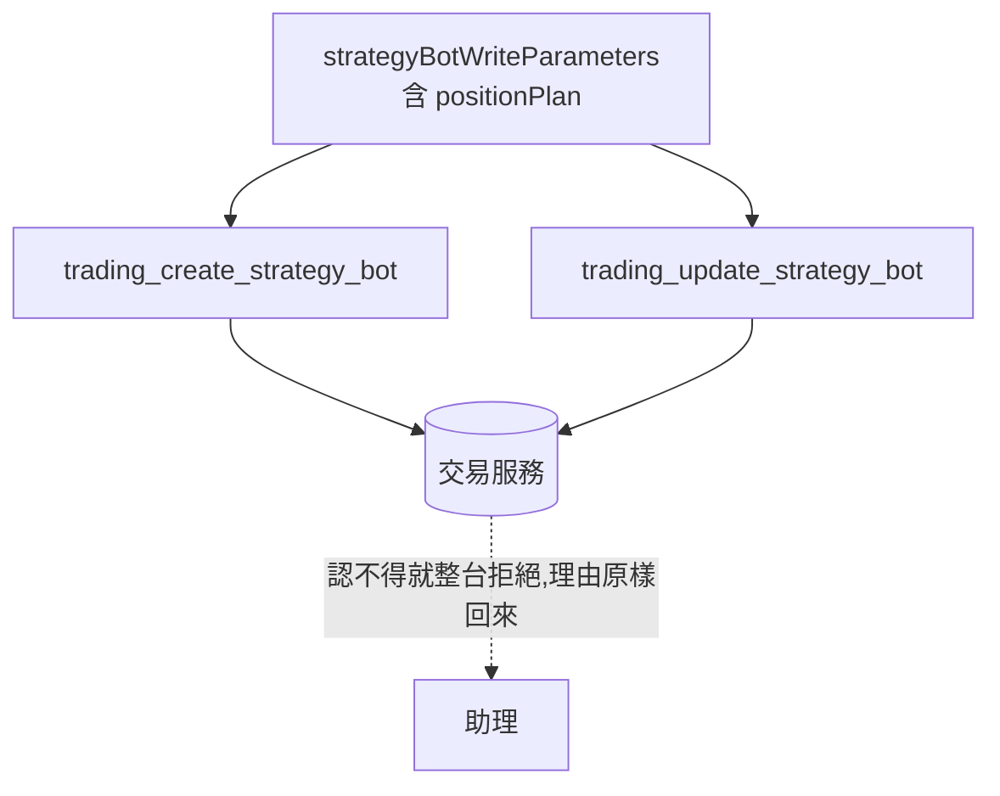

# 策略機器人的部位規劃 — Architecture Design

**Status:** Confirmed
**Source PRD:** `.sdd/2026-09-18-strategy-bot-position-plan/PRD.md`
**Tech context:** Go · Clean / Onion Architecture · MCP 工具清單（宣告式）

---

## 1. Design Goal & Guiding Principle

**In one sentence：** 在那份共用的機器人欄位清單上多一個**巢狀物件**，
而整條轉達路徑一行不動。

**Guiding principle：** 與上一刀（`2026-09-18-trading-strategy-trading-mode`）同一句話——
**這個連接器的全部行為都在那份清單裡**。`tool_catalog.go` 開頭寫著：
「加第五十一件能力就是加一筆宣告——沒有 handler、沒有分支、其他檔案一個字都不動。」
**加一個欄位也一樣。**

**唯一的結構性決定：一個巢狀物件，不是五個平行欄位。**

那五樣**只有一起才有意義**。攤平成五個 `bodyParameter` 之後，
助理填得出「槓桿 3 倍」而沒有資金——一個**沒有東西會拒絕、送出去之後什麼也不會發生**的組合。
巢狀讓「這一組要嘛給、要嘛不給」寫在形狀上，而不是寫在讀說明的人腦子裡。

這個專案已經有一個一模一樣的前例：**交易策略的兩棵條件樹**
（`tool_catalog_strategy.go` 的 `buyCondition`／`sellCondition`）也是
`ToolParameterKindObject`，也是「照它被想的形狀送」。照抄那個形狀。

---

## 2. Change Scope

| Area | Action | What / Why |
| :--- | :--- | :--- |
| `strategyBotWriteParameters()` | **Modify** | 多一個選填的 `positionPlan`，型別 `Object`。建立與改寫**共用這一份**，所以只加一次 |
| `trading_create_strategy_bot` 的說明 | **Modify** | 多一句：**回測沒有把止損止盈算進去**。助理的下一步最可能正是拿回測漂亮的規則配停損 |
| `trading_update_strategy_bot`／其餘機器人能力 | **Not touched** | 它們吃的是同一份欄位清單的輸出 |
| `trading_get_strategy_bot`／`trading_list_strategy_bots`／`trading_list_strategy_bot_runs` | **Not touched** | 不宣告回應欄位；交易服務多回 `positionPlan` 與那三個數字就自然帶到助理面前 |
| `backtestParameters()`／交易策略那幾支 | **Not touched** | 部位規劃與回測無關——這正是上一刀之後兩者各管一條路的樣子 |
| `internal/` 每一層 | **Not touched** | 這一刀完全落在組裝根的宣告裡 |
| `.sdd/UL-MAP.md` | **Not touched** | 那七個詞由交易服務定義；本專案的 UL-MAP 只收連接器自己的詞 |

---

## 3. New Classes / Modules

**沒有新型別、沒有新函式。** 一個欄位、一句說明。

那正是它該有的樣子：上一刀是「搬一個欄位不該動到任何一層」的檢驗，
這一刀是「加一個欄位」的同一個檢驗。兩次都通過，那個承諾才算還在。

---

## 4. Modified Components

| Component | Current role | Change needed |
| :--- | :--- | :--- |
| `strategyBotWriteParameters()` | 一台機器人由什麼組成，建立與改寫共用 | 多一欄。位置放**最後**——前四樣是「這台機器是什麼」（叫什麼、盯哪裡、聽誰的、多久醒），部位規劃是「它建議多大」，順序上跟著那四樣走 |
| `trading_create_strategy_bot` 的說明 | 這件能力是什麼、什麼會被拒絕 | 多一句關於回測沒算止損止盈的話 |

### 那一欄的說明怎麼寫

這一欄與這份清單裡的每一個別的欄位有一個關鍵差別：**填錯不會被拒絕。**

- 槓桿填給一個現貨帳戶 → 交易服務收下（槓桿是合法的值），
  後果是那台機器人的訊息多出兩行不該有的字。
- 填了其餘四樣卻漏了資金 → 交易服務收下，讀作「沒有部位規劃」，
  後果是那四樣全部無效而**什麼錯誤都不會回來**。

所以說明是這裡**唯一的守衛**，而它要講的六件事全部是 PRD US-02 的驗收項：

```
整組可以不給；不給資金就是這台機器人不建議部位（資金是這一組的開關）
金額一律用字串給精確小數
sizingMode 三選一：allIn／percentage／fixedAmount，不給即 allIn
不給 leverage 就是不上槓桿；現貨帳戶不要給
stopLossPercentage／takeProfitPercentage 是百分點，各自可以單獨不給
```

### 為什麼那一句警告寫在能力的說明上，而不是欄位上

它講的不是「這一欄怎麼填」，而是**「這件事與你剛剛做過的另一件事沒有對過帳」**。
助理的一整圈工作是「建規則 → 回測 → 讀成績單 → 調整 → 上線」，
而它最自然的下一步正是拿一套回測漂亮的規則配上停損。
那句話屬於「上線」這件能力本身，不屬於任何一個欄位。

---

## 5. Component Relationships



**一份欄位清單，兩個吃它的人。** 建立與改寫真的完全一樣——改寫是整台改寫——
所以共用整份，而不是像兩支回測那樣只共用真正共用的那幾欄。

---

## 6. Traceability

| PRD Scenario | Component |
| :--- | :--- |
| 建立時給整組／修改時也給得出來 | `strategyBotWriteParameters()` 的新那一欄 |
| 兩支共用同一份欄位清單 | `strategyBotApiTools()` 兩處都呼叫同一個函式（未改動） |
| 完全沒提部位規劃 → 不進 body | `ApiToolDomain.BuildRequest`（未改動的選填欄位行為） |
| 部位規劃不是必填 | `bodyParameter(..., false)` |
| 填了交易服務不接受的數字 → 照送 | 連接器不驗證（未改動） |
| 整組選填、資金是開關 | 那一欄說明的第一句 |
| 金額用字串 | 那一欄說明 |
| 槓桿不填即不上槓桿、現貨不要填 | 那一欄說明 |
| 兩個距離是百分點、各自可單獨不填 | 那一欄說明 |
| 回測沒有把止損止盈算進去 | `trading_create_strategy_bot` 的 `Description()` |

---

## 7. Extensibility & Handoff Notes

- **Most likely next requirement：回測也模擬止損止盈（交易服務的下一刀）。**
  **Where it lands：** 把那一句警告從 `trading_create_strategy_bot` 的說明裡**拿掉**。
  **那句話還在不在，就是那一刀有沒有做完的判準**——與交易服務的訊息裡那一行同一條界線。

- **第二可能：停損距離由策略腳本算（ATR）。**
  **Where it lands：** 那個物件的說明多一句，講出距離也可以由腳本來。
  欄位本身不動——這個連接器**從來不列舉取值**。

- **給下一位的提醒：** 這一欄是這份清單裡**唯一一個填錯不會被拒絕的欄位**。
  別的欄位錯了，交易服務會回一句話；這一欄錯了（現貨填槓桿、漏填資金），
  交易服務會收下，而代價落在讀訊息的人身上。
  **改它的說明之前先想清楚你拿掉的是哪一道守衛。**

---

## 8. Appendix

- `.sdd/2026-09-18-strategy-bot-position-plan/PRD.md`
- `.sdd/2026-09-18-trading-strategy-trading-mode/ARCH.md`——上一刀，同一個承諾的另一次檢驗
- `.sdd/2026-09-17-trading-assistant-connector/ARCH.md`——這份工具清單的形狀與它的承諾
- 交易服務的 `.sdd/2026-09-18-strategy-bot-position-plan/ARCH.md`——另一端的落點
