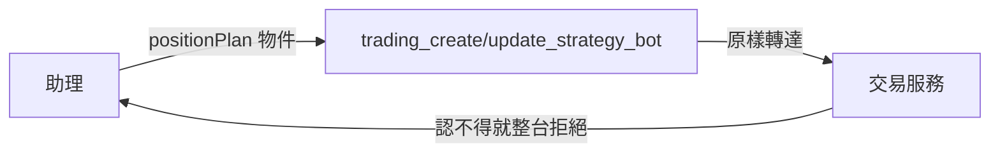

# Product Requirements Document (PRD)

**Status:** Finalized
**Version:** v1.0
**Owner:** James Hsueh
**Stakeholders:** Engineering

---

## 1. Background & Goal (Why & Goal)

### Problem Statement

交易服務讓一台策略機器人記得一組**部位規劃**（部位資金、倉位大小模式與數值、
槓桿倍數、停損距離、停利距離），填了之後它每一輪的訊息自己算完
**開倉押多少、止損在哪、止盈在哪**。

這個連接器**說不出那一組**。助理組得出一台機器人，卻組不出一台**會建議部位**的機器人——
使用者於是得自己打開畫面填那五個數字，而助理剛剛才替他把整台組好。

### Expected Outcome

- `trading_create_strategy_bot` 與 `trading_update_strategy_bot`
  各多一個**選填的 `positionPlan` 物件**，兩支共用同一份欄位清單。
- 說明講得出**整組選填、資金是開關、金額用字串、槓桿不填即不上槓桿、
  現貨不要填槓桿、兩個距離是百分點**。
- 說明講得出**訊息建議的停損，回測從來沒有模擬過**。
- 連接器**不驗證、不轉換、不補預設值**。

### Out of Scope

- **在連接器裡驗證那五個數字**——第二份規則清單一定會漂移。
- **在連接器裡補預設值**——「不填資金即不建議部位」是交易服務的規則。
- **替助理決定要不要填**——它看不到使用者的帳戶。
- **讀取／清單／執行紀錄那幾支的形狀**——它們不宣告回應欄位。

---

## 2. User Personas

**Primary Role:** **助理**。它替使用者建規則、回測、組機器人。
它看得到的**只有這份工具清單**——一個欄位存不存在、說明寫什麼，就是它全部的依據。

**Secondary Role:** 使用者。他會說「幫我開一台，我有五萬、押一成、三倍、停損三個點」——
那句話能不能落到對的欄位上，決定他要不要自己再打開畫面一次。

**Usage Context:** 助理組一台機器人是**一次對話裡的最後一步**：
規則調好了、回測看過了，接著要它上線。**那一步漏掉部位規劃，就是漏掉整段工作的結論。**

---

## 3. User Stories & Acceptance Criteria

### US-01 — 助理組得出一台會建議部位的機器人 [priority: P0]

**As an** 助理，**I want** 組機器人時說得出那五個數字，
**so that** 使用者不必在我剛替他組好一台之後，自己再打開畫面填一次。

```gherkin
Scenario: 建立時給整組
  Given 使用者說他有五萬、押一成、三倍、停損三個點、停利五個點
  When 我呼叫 trading_create_strategy_bot,positionPlan 給那五樣
  Then 那個物件原樣出現在送往交易服務的 body 裡

Scenario: 修改時也給得出來
  Given 一台既有的機器人
  When 我呼叫 trading_update_strategy_bot,positionPlan 給那五樣
  Then 那個物件原樣出現在送往交易服務的 body 裡

Scenario: 兩支共用同一份欄位清單
  Given 建立與改寫這兩件能力
  When 我比對它們的欄位
  Then 部位規劃在兩支上一字不差
  And 改寫多出來的只有那個路徑上的識別碼

Scenario: 完全沒提部位規劃
  Given 我要組一台機器人
  When 我沒有填 positionPlan
  Then 送出的 body 裡沒有那個欄位
  And 那台機器人不建議部位

Scenario: 部位規劃不是必填
  Given 建立與改寫這兩件能力
  When 我讀它們的欄位清單
  Then positionPlan 不是必填

Scenario: 填了一個交易服務不接受的數字
  Given 我要組一台機器人
  When 我把押多少的百分比填成 150
  Then 連接器照送,不自己擋
  And 交易服務整台拒絕,理由原樣回到我手上
```

### US-02 — 說明講得出助理填不對就會出錯的每一件事 [priority: P0]

**As an** 助理，**I want** 那一欄的說明把每一個陷阱寫出來，
**so that** 我替一個我看不到的帳戶填這五個數字時,不是在猜。

```gherkin
Scenario: 整組選填,而資金是開關
  Given positionPlan 那一欄
  When 我讀它的說明
  Then 說明講得出整組可以不給
  And 說明講得出不給資金就是這台機器人不建議部位

Scenario: 金額用字串給精確小數
  Given positionPlan 那一欄
  When 我讀它的說明
  Then 說明講得出金額要用字串給

Scenario: 槓桿不填就是不上槓桿,而現貨不要填
  Given positionPlan 那一欄
  When 我讀它的說明
  Then 說明講得出不填槓桿就是不上槓桿
  And 說明講得出現貨帳戶不要填槓桿

Scenario: 兩個距離是百分點,各自可以單獨不填
  Given positionPlan 那一欄
  When 我讀它的說明
  Then 說明講得出停損與停利是百分點
  And 說明講得出各自可以單獨不填
```

### US-03 — 助理知道那個停損沒有被回測驗證過 [priority: P0]

**As an** 助理，**I want** 被告知這件事，
**so that** 我不會把一套「回測賺 25%」的規則配上一組從來沒對過帳的停損交給使用者。

```gherkin
Scenario: 那一支能力的說明講出這件事
  Given trading_create_strategy_bot
  When 我讀它的說明
  Then 說明講出回測沒有把止損止盈算進去
```

---

## 4. Business Flow & Logic

### 那一組欄位經過哪裡



### Core Business Rules

1. **`positionPlan` 是一個巢狀物件**，裡面五樣（資金、押多少模式與數值、槓桿、停損距離、停利距離）。
   **巢狀而不是攤平**：那五樣只有一起才有意義，攤平之後助理填得出「槓桿 3 倍但沒有資金」——
   一個沒有東西會拒絕、送出去之後什麼也不會發生的組合。
2. **選填，不補預設值。** 省略時那個欄位**不出現在 body 裡**。
3. **不驗證取值。** 認不得的值照送，由交易服務整台拒絕。
4. **建立與改寫共用同一份欄位清單**——改寫是整台改寫。
5. **說明必須講出六件事**（整組選填／資金是開關／金額用字串／槓桿不填即不上／
   現貨不要填槓桿／兩個距離是百分點），因為那六件**每一件填錯都不會被拒絕**，
   只會讓使用者拿到一則錯的訊息。
6. **能力的說明必須講出「回測沒有把止損止盈算進去」。**

### 沿用的既有規則（不生第二套說法）

| 規則 | 與誰相同 |
| :--- | :--- |
| 金額一律以字串給精確小數 | 回測的 `initialCapital`、`positionSizingValue` |
| 選填欄位省略時不出現在 body 裡 | 連接器既有的每一個選填欄位 |
| 不驗證、不轉換，拒絕原樣轉達 | 連接器既有的每一件能力 |
| 巢狀物件照它被想的形狀送 | 交易策略的兩棵條件樹 |

### Edge Cases

| 情況 | 行為 |
| :--- | :--- |
| 助理只填 `capital`，其餘四樣不填 | 照送；交易服務把押多少讀作全押、槓桿讀作一倍 |
| 助理填了槓桿卻沒填資金 | 照送；交易服務讀作「沒有部位規劃」，那四樣都不算 |
| 助理把槓桿填成 1 | 照送；交易服務讀作不上槓桿，與不填一字不差 |
| 交易服務日後多一個部位規劃欄位 | 這裡在那個物件的說明裡多一句，欄位本身不動 |

---

## 5. UI/UX Design & Interaction

沒有畫面。這件事的全部介面就是**那一欄的說明**。

它與別的欄位不同的地方是：**填錯不會被拒絕**。
填了槓桿給一個現貨帳戶、少填了資金卻填了其餘四樣——交易服務都會收下，
而後果是使用者讀到一則錯的訊息。**所以說明是這裡唯一的守衛**，
每一句都是驗收項而不是文案偏好。

---

## 6. Non-Functional Requirements

- **相容**：既有的每一件能力（名稱、需不需要登入、路徑、動詞）一個都不變。
- **相容**：機器人那幾支既有的欄位一個都不動。
- **一致**：部位規劃的取值與預設值**不在這個專案裡出現第二份**。
- **可讀**：每一個欄位都有說明、有型別（既有測試守著這條）。

---

## 7. Dependencies & Risks

- **依賴**：交易服務的 `POST/PUT /strategy-bots` 收 `positionPlan`
  （見交易服務的 `.sdd/2026-09-18-strategy-bot-position-plan/`）。
- **風險**：兩端不同時到位時，助理送的 `positionPlan` 會被忽略。
  緩解——連接器不驗證、照送，服務端多一個不認得的鍵本來就會被忽略。
- **風險**：說明漏了「現貨不要填槓桿」，助理會替現貨帳戶填槓桿，
  而**那不會被拒絕**——它只會讓那台機器人的訊息多出兩行不該有的字。
  緩解——把那一句列為驗收項（US-02）。
- **風險**：助理拿一套回測漂亮的規則配上停損交給使用者，
  而那兩件事從來沒有對過帳。
  緩解——把「回測沒有把止損止盈算進去」列為驗收項（US-03）。

---

## 8. Appendix

- `.sdd/2026-09-18-strategy-bot-position-plan/BRIEF.md`
- 交易服務的 `.sdd/2026-09-18-strategy-bot-position-plan/PRD.md`——那五個數字與六條規則的出處
- `.sdd/2026-09-18-trading-strategy-trading-mode/PRD.md`——上一刀，同樣是一個欄位換家
- `.sdd/2026-09-17-trading-assistant-connector/PRD.md`——這份工具清單的出處
