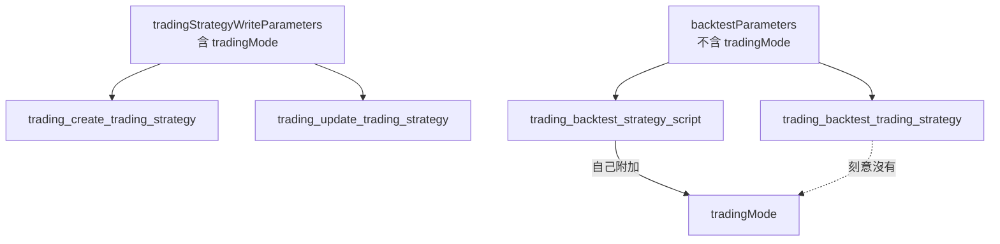

# 交易策略的交易模式 — Architecture Design

**Status:** Confirmed
**Source PRD:** `.sdd/2026-09-18-trading-strategy-trading-mode/PRD.md`
**Tech context:** Go · Clean / Onion Architecture · MCP 工具清單（宣告式）

---

## 1. Design Goal & Guiding Principle

**In one sentence：** 把 `tradingMode` 從「每一次回測都共用的條件」移到
「它真正屬於的那三件能力身上」，而整條轉達路徑一行不動。

**Guiding principle：** 這個連接器的**全部行為都在那份清單裡**。
`tool_catalog.go` 開頭已經寫死了：「這份清單就是功能本身，
五十件能力共用同一條路，讓它們各自不同的只有清單裡寫的那幾行。」

所以這一刀**沒有任何流程改動**：不加 handler、不加分支、不碰任何一層。
它改的是三個宣告——一個欄位換家、一段說明換句話。

**唯一的結構性決定：拆掉 `backtestParameters()` 裡的 `tradingMode`。**
那個函式當初共用是因為兩支回測要的條件真的一樣。現在不一樣了——
一支問使用者，一支問那一份交易策略。共用清單留下的必須是
**兩支都真的要的那幾欄**；`tradingMode` 從清單裡移出，由策略腳本那一支**自己附加**
（它本來就已經在附加另外四欄）。

硬把它留在共用清單裡，等於讓交易策略那一支多一個**交易服務會安靜忽略的假欄位**——
而助理沒有辦法發現自己被忽略了。

---

## 2. Change Scope

| Area | Action | What / Why |
| :--- | :--- | :--- |
| `tradingStrategyWriteParameters()` | **Modify** | 多一個選填的 `tradingMode`。建立與改寫**共用這一份**，所以只加一次 |
| `backtestParameters()` | **Modify** | **移出** `tradingMode`。留下的是兩支回測都真的要的那幾欄 |
| `trading_backtest_strategy_script` | **Modify** | 自己附加 `tradingMode`，與它本來就在附加的另外四欄並排。**送出的形狀與說明一字不差** |
| `trading_backtest_trading_strategy` | **Modify** | 欄位少一個；說明多兩句：交易模式取自那一份、要改就去改那一份 |
| `trading_create_trading_strategy`／`trading_update_trading_strategy` | **Modify** | 不改一行——它們吃的是 `tradingStrategyWriteParameters()` 的輸出 |
| `trading_list_trading_strategies`／`trading_get_trading_strategy` | **Not touched** | 不宣告回應欄位；服務多回一個 `tradingMode` 就自然帶到助理面前 |
| `domains.ApiToolDomain`／`vo.ToolParameterVo`／`BuildRequest` | **Not touched** | 選填欄位省略時不進 body，是既有行為 |
| `internal/` 每一層 | **Not touched** | 這一刀完全落在組裝根的宣告裡 |
| 機器人相關的每一件能力 | **Not touched** | 機器人引用哪一份沒變，訊息措辭是交易服務的事 |
| `.sdd/UL-MAP.md` | **Not touched** | 交易模式三個詞由交易服務定義，本專案的 UL-MAP 只收連接器自己的詞 |

---

## 3. New Classes / Modules

**沒有新型別、沒有新函式。** 這一刀是三個宣告的位置與措辭。

那正是它該有的樣子：`tool_catalog.go` 承諾過「加第五十一件能力就是加一筆宣告——
沒有 handler、沒有分支、其他檔案一個字都不動」。
**搬一個欄位也一樣。** 如果搬一個欄位需要動到 `internal/`，
那個承諾就已經破了，而這一刀正好是它的一次檢驗。

---

## 4. Modified Components

| Component | Current role | Change needed |
| :--- | :--- | :--- |
| `tradingStrategyWriteParameters()` | 一份交易策略由什麼組成，建立與改寫共用 | 多一欄。位置緊接 `name` 之後——交易模式與名稱同屬「這份規則**是**什麼」，而來源與條件是「它由什麼**組成**」 |
| `backtestParameters()` | 一次重演照哪些帳戶條件走 | 移出 `tradingMode`。註解要說清楚**為什麼它不在這裡**，否則下一個人只會把它加回來 |
| `backtestApiTools()` | 兩支回測能力的宣告 | 策略腳本那一支附加 `tradingMode`；交易策略那一支說明多兩句 |

### 欄位說明怎麼寫

助理挑的是**它看不到的那個帳戶**的性質。它讀不到券商、讀不到市場能不能做空，
唯一的線索是使用者講的那句話。所以說明必須把那句話**對應到一個拼法**：

```
spot 只做多（賣出＝平掉回現金，空手時賣出不動作）
longShort 做得了空（賣出＝平掉多倉並反手做空）
省略即 longShort
使用者說他的帳戶不能放空（台股現貨、ETF、多數券商帳戶）時給 spot
```

最後那一句是驗收項而不是文案偏好（PRD US-01）。少了它，
助理知道有兩個拼法，但不知道哪一個對應到使用者剛講的那句話。

### 為什麼交易策略回測那一支的說明要講「去哪裡改」

拿掉一個旋鈕，助理只知道**自己沒有它**；它不會自動知道**旋鈕在哪**。
使用者這時說「我的帳戶不能放空」，助理手上沒有可以動的東西，
最可能的反應是回報它辦不到——而正確的反應是去改那一份交易策略。
那一句話是這兩件事之間唯一的連接。

---

## 5. Component Relationships



**一份欄位清單只有在每一個吃它的人都真的要那幾欄時才該共用。**
寫入那一份（建立、改寫）真的完全一樣，所以共用整份；
兩支回測不再完全一樣，所以共用的縮到真正共用的那幾欄，
差異由需要它的那一支自己附加——而不是由不需要它的那一支默默吃下去。

---

## 6. Traceability

| PRD Scenario | Component |
| :--- | :--- |
| 建立一份現貨型交易策略 | `tradingStrategyWriteParameters()` 的新那一欄 |
| 改掉一份交易策略的交易模式 | 同上（同一份清單，兩支共用） |
| 兩支共用同一份欄位清單 | `tradingStrategyApiTools()` 兩處都呼叫同一個函式（未改動） |
| 完全沒提交易模式 → 不進 body | `ApiToolDomain.BuildRequest`（未改動的選填欄位行為） |
| 交易模式不是必填 | `bodyParameter(..., false)` |
| 填了認不得的值 → 連接器照送 | 連接器不驗證（未改動） |
| 說明講得出我該怎麼挑 | `tradingStrategyWriteParameters()` 那一欄的說明字串 |
| 重演一份交易策略沒有那一欄 | `backtestParameters()` 移出＋那一支不附加 |
| 說明講出為什麼沒有 | `trading_backtest_trading_strategy` 的說明 |
| 說明講出要改的話去哪裡改 | 同上 |
| 重演一支策略腳本仍然有那一欄 | 那一支自己附加的 `tradingMode` |
| 兩支除了它之外一字不差 | 兩支仍然都吃 `backtestParameters()` 的輸出 |

---

## 7. Extensibility & Handoff Notes

- **Most likely next requirement：交易服務多一種交易模式。**
  **Where it lands：** 三處欄位說明裡的那一句話。
  欄位本身、送出的形狀、任何一層程式碼都不動——
  因為這個連接器**從來不列舉取值**，它只轉述。

- **第二可能：合約的開倉金額與止盈止損（交易服務的下一刀）。**
  **Where it lands：** 看交易服務把那幾個原料放在哪一個 endpoint 上。
  若落在機器人身上，就是 `strategyBotWriteParameters()` 多幾欄；
  若落在一個新的「帳戶設定」上，就是一組新的能力宣告。
  **不要先在這裡開欄位**——連接器沒有欄位可以轉達一個還不存在的 endpoint。

- **給下一位的提醒：** `backtestParameters()` 現在**刻意**不含 `tradingMode`，
  而那個函式的名字（「一次重演照哪些帳戶條件走」）讀起來像是應該含它。
  註解裡寫著為什麼不含。看到那一欄只在其中一支上而想「統一一下」之前，
  先確認交易服務那兩個 endpoint 現在收不收它——
  統一回去的代價是其中一支多一個會被安靜忽略的假欄位。

---

## 8. Appendix

- `.sdd/2026-09-18-trading-strategy-trading-mode/PRD.md`
- `.sdd/2026-09-17-trading-assistant-connector/ARCH.md`——這份工具清單的形狀與它的承諾
- 交易服務的 `.sdd/2026-09-18-trading-strategy-trading-mode/ARCH.md`——另一端的落點
