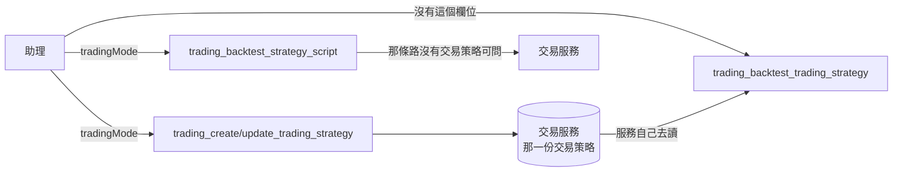

# Product Requirements Document (PRD)

**Status:** Finalized
**Version:** v1.0
**Owner:** James Hsueh
**Stakeholders:** Engineering

---

## 1. Background & Goal (Why & Goal)

### Problem Statement

交易服務把**交易模式**（`spot` 現貨 / `longShort` 多空反手）從「一次回測的參數」
搬成**一份交易策略記著的欄位**：一套規則是寫給能放空的帳戶、還是只能做多的帳戶，
是規則本身的性質。

這個連接器兩處都跟不上：

**建交易策略時沒有那個選項。** 助理替使用者拼出一份交易策略，說不出它是現貨型的。
那一份於是落在預設值（多空反手），而使用者的台股現貨帳戶不能放空。
之後每一次重演都照他做不到的操作算——助理拿到的成績單**從第一次就是錯的**，
而它會拿那張成績單去調條件。

**重演一份交易策略時還留著那個選項。** 那個欄位在交易服務那頭已經不存在，
助理填了會被**安靜地忽略**。它會以為自己指定了現貨、拿到的卻是多空反手的成績單。
一個填了沒反應的欄位，比一個沒有的欄位更容易讓人下錯結論。

### Expected Outcome

- `trading_create_trading_strategy` 與 `trading_update_trading_strategy`
  **各多一個選填的 `tradingMode`**，兩支共用同一份欄位清單。
- 欄位說明講得出**兩個拼法的意思、不給會怎樣、使用者不能放空時給哪一個**。
- `trading_backtest_trading_strategy` **沒有 `tradingMode`**，
  說明講出它取自那一份交易策略，並指出**要改就去改那一份**。
- `trading_backtest_strategy_script` **一個字都沒變**，仍然有 `tradingMode`。
- 連接器**不驗證、不轉換、不補預設值**：認不得的值由交易服務整份拒絕，理由原樣交回助理。

### Out of Scope

- **在連接器裡驗證交易模式**——第二份「有哪幾種」的清單一定會漂移。
- **在連接器裡補預設值**——省略即預設是交易服務的規則。
- **替助理挑一個**——它看不到使用者的帳戶。
- **交易策略清單／讀取工具**——它們不宣告回應欄位，服務多回一欄就自然帶到助理面前。
- **任何機器人工具**——機器人引用哪一份沒有變，訊息的措辭是交易服務的事。

---

## 2. User Personas

**Primary Role:** **助理**（透過 MCP 連上這個連接器的模型）。
它替使用者拼交易策略、重演、讀成績單、再調整。它看得到的**只有這份工具清單**——
一個欄位存不存在、說明寫什麼，就是它全部的依據。

**Secondary Role:** 使用者。他不直接看這些工具，但他會說
「我的帳戶不能放空」——那句話能不能落到對的欄位上，決定他拿到的成績單對不對。

**Usage Context:** 一次對話裡助理可能來回數十趟：拼一份、重演、不滿意再改、再重演。
**一個被安靜忽略的欄位在這種節奏下永遠不會被發現**——每一趟都成功回應，數字卻一直是另一套規矩算的。

---

## 3. User Stories & Acceptance Criteria

### US-01 — 建立與修改交易策略時說得出交易模式 [priority: P0]

**As an** 助理，**I want** 建交易策略時說得出它是寫給哪一種帳戶的，
**so that** 使用者的成績單從第一次就對得上他真的做得到的操作。

```gherkin
Scenario: 建立一份現貨型交易策略
  Given 使用者說他的帳戶不能放空
  When 我呼叫 trading_create_trading_strategy,tradingMode 填 spot
  Then 那個值原樣出現在送往交易服務的 body 裡

Scenario: 改掉一份交易策略的交易模式
  Given 一份既有的交易策略
  When 我呼叫 trading_update_trading_strategy,tradingMode 填 longShort
  Then 那個值原樣出現在送往交易服務的 body 裡

Scenario: 兩支共用同一份欄位清單
  Given 建立與改寫這兩件能力
  When 我比對它們的欄位
  Then 交易模式在兩支上一字不差
  And 改寫多出來的只有那個路徑上的識別碼

Scenario: 完全沒提交易模式
  Given 我要建一份交易策略
  When 我沒有填 tradingMode
  Then 送出的 body 裡沒有那個欄位
  And 由交易服務套用它自己的預設值

Scenario: 交易模式不是必填
  Given 建立與改寫這兩件能力
  When 我讀它們的欄位清單
  Then tradingMode 不是必填

Scenario: 填了一個認不得的值
  Given 我要建一份交易策略
  When 我把 tradingMode 填成 dayTrade
  Then 連接器照送,不自己擋
  And 交易服務整份拒絕,理由原樣回到我手上

Scenario: 說明講得出我該怎麼挑
  Given 建立與改寫這兩件能力
  When 我讀 tradingMode 的說明
  Then 說明講得出 spot 與 longShort 各自的意思
  And 說明講得出不給會怎樣
  And 說明講得出使用者說他不能放空時要給 spot
```

### US-02 — 重演一份交易策略時沒有交易模式可以給 [priority: P0]

**As an** 助理，**I want** 那個旋鈕直接不存在，
**so that** 我不會以為自己指定了現貨、卻拿到另一套規矩算出來的成績單。

```gherkin
Scenario: 那件能力沒有交易模式這一欄
  Given trading_backtest_trading_strategy
  When 我讀它的欄位清單
  Then 裡面沒有 tradingMode

Scenario: 說明講出為什麼沒有
  Given trading_backtest_trading_strategy
  When 我讀它的說明
  Then 說明講出交易模式取自那一份交易策略本身
  And 說明講出這裡不必也不能再說一次

Scenario: 說明講出要改的話去哪裡改
  Given 使用者說他的帳戶不能放空
  When 我讀 trading_backtest_trading_strategy 的說明
  Then 說明指出要去 trading_update_trading_strategy 改那一份的 tradingMode
```

### US-03 — 重演一支策略腳本那條路一個字都沒變 [priority: P0]

**As an** 助理，**I want** 那條路照舊，
**so that** 沒有交易策略可問的時候,我仍然講得出這一次要照哪一套規矩算。

```gherkin
Scenario: 那件能力仍然有交易模式
  Given trading_backtest_strategy_script
  When 我讀它的欄位清單
  Then 裡面有 tradingMode,選填,說明與這個切片之前一字不差

Scenario: 該共用的每一欄仍然共用
  Given 兩支回測能力
  When 我比對它們的欄位
  Then 除了 tradingMode 之外,回測共通的每一欄在兩支上一字不差
```

---

## 4. Business Flow & Logic

### 交易模式在這個連接器裡經過哪裡



### Core Business Rules

1. **`tradingMode` 只出現在三處**：建交易策略、改交易策略、重演一支策略腳本。
2. **重演一份交易策略沒有它**——那一份自己記著，第二個答案需要一條裁決規則。
3. **選填，不補預設值**。省略時那個欄位**不出現在 body 裡**，
   由交易服務套用它自己的預設值；連接器不寫第二份預設值。
4. **不驗證取值**。認不得的值照送，由交易服務整份拒絕，理由原樣交回助理。
5. **建立與改寫共用同一份欄位清單**——改寫是整份改寫，沒有哪個欄位只在一條路上能填。
6. **兩支回測仍然共用那些真的共用的條件**（交易標的、起訖時間、初始資金、倉位大小模式）。
   拆開的只有 `tradingMode` 這一欄。
7. **說明是助理唯一的依據**。它必須講出兩個拼法的意思、省略的後果，
   以及「使用者說不能放空」要對應到哪一個——它讀不到使用者的券商。

### 沿用的既有規則（不生第二套說法）

| 規則 | 與誰相同 |
| :--- | :--- |
| 選填欄位省略時不出現在 body 裡 | 連接器既有的每一個選填欄位 |
| 不驗證、不轉換，拒絕原樣轉達 | 連接器既有的每一件能力 |
| 說明寫給助理而非寫給讀文件的人 | `tool_catalog.go` 開頭訂下的兩條規則 |

### Edge Cases

| 情況 | 行為 |
| :--- | :--- |
| 助理在重演一份交易策略時硬塞 `tradingMode` | 那個欄位不在清單裡，**連接器不會把它放進 body**——助理的多餘輸入到不了交易服務 |
| 助理把 `tradingMode` 填成空字串 | 照送空字串；交易服務讀作省略（它的既有規則） |
| 助理填了大小寫不同的拼法（`SPOT`） | 照送；交易服務的大小寫寬容度處理它 |
| 交易服務日後多一種交易模式 | 這裡只改欄位說明那一句，欄位本身與送出的形狀都不動 |

---

## 5. UI/UX Design & Interaction

沒有畫面。這件事的全部介面就是**工具清單**：欄位在不在、說明寫什麼。

- 欄位**存在**等於「這件事你講得出來」；**不存在**等於「這件事不是你決定的」。
- 說明**沒有把使用者那句話對應到拼法**，助理就只能猜——
  所以「不能放空就給 `spot`」是驗收項，不是文案偏好。

---

## 6. Non-Functional Requirements

- **相容**：`trading_backtest_strategy_script` 的欄位與說明**一字不差**。
- **相容**：既有的每一件能力（名稱、需不需要登入、路徑、動詞）一個都不變。
- **一致**：交易模式的取值與預設值**不在這個專案裡出現第二份**。
- **可讀**：每一個欄位都有說明、有型別（既有測試守著這條）。

---

## 7. Dependencies & Risks

- **依賴**：交易服務的 `POST/PUT /trading-strategies` 收 `tradingMode`，
  而 `POST /trading-strategies/{id}/backtests` 不收（見交易服務的
  `.sdd/2026-09-18-trading-strategy-trading-mode/`）。
- **風險**：這兩端若不同時到位，助理會拿著一個服務不認得的欄位。
  緩解——欄位不驗證、照送，服務端多一個不認得的鍵**本來就會被忽略**，
  所以先到的那一端不會壞掉，只是那個選項暫時無效。
- **風險**：拆共用的回測欄位清單時漏拆，其中一支會多／少一欄。
  緩解——把「兩支除了 `tradingMode` 之外一字不差」列為驗收項（US-03）。

---

## 8. Appendix

- `.sdd/2026-09-18-trading-strategy-trading-mode/BRIEF.md`
- 交易服務的 `.sdd/2026-09-18-trading-strategy-trading-mode/PRD.md`——交易模式歸屬的出處
- 交易服務的 `.sdd/UL-MAP.md`——交易模式、現貨、多空反手的詞彙定義
- `.sdd/2026-09-17-trading-assistant-connector/PRD.md`——這份工具清單的出處
