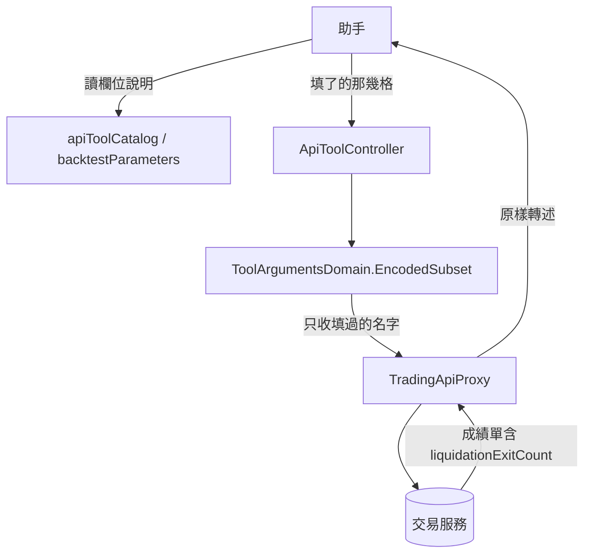

# 回測的槓桿與強制平倉（連接器）— Architecture Design

**Status:** Confirmed
**Source PRD:** `.sdd/2026-09-20-leveraged-backtest-liquidation/PRD.md`
**Tech context:** Go · Clean / Onion · 能力清單住在組裝根（`cmd/server/tool_catalog*.go`）

---

## 1. Design Goal & Guiding Principle

**In one sentence:** 讓兩支重演能力宣告得出槓桿那兩格（於是它們**到得了**交易服務），
並在說明裡寫出助手送出去之前查不到的六件事，而兩格都不填時轉出去的內容一字不差。

**Guiding principle — 這一刀只動清單，一行流程都不動。**

連接器的整個設計就是「新增一件事＝在清單補一列」。這一刀連一列都不必補——
它是在兩支既有能力**共用的那一組欄位**上加兩格。所以：

- **沒有新的 Domain Model、沒有新的介面、沒有新的驗證。** 一個都不該有。
- 轉達的機制（`EncodedSubset` 只收填過的名字）**本來就**給了「留白的不上線」，
  所以「兩格都不填時一字不差」不是要寫的東西，是不要寫東西就會成立的東西。

**這一刀真正的產出是那幾段文字。** 助手讀得到的只有欄位說明，
所以說明的措辭就是這個功能本身——程式碼那部分是兩行。

---

## 2. Change Scope

| Area | Action | What / Why |
| :--- | :--- | :--- |
| `cmd/server/tool_catalog.go` · `backtestParameters()` | **Modify** | 多兩個 `bodyParameter`。兩支重演共用這一組，所以加一次就兩支都有。 |
| `cmd/server/tool_catalog.go` · 新增 `liquidationReportCardNote` | **Add** | 成績單那一格的說明，**兩支共用一份常數**，比照既有的 `costedReportCardNote`。 |
| `cmd/server/tool_catalog_strategy.go` · 兩支重演能力的說明 | **Modify** | 各接上那一段常數。 |
| `cmd/server/tool_catalog_test.go` | **Modify** | 補上這一刀的驗收。 |
| **`ToolArgumentsDomain` / `EncodedSubset`** | **Not touched** | 「留白的不上線」是它既有的行為，這一刀靠它，不改它。 |
| **任何 Domain Model / 介面 / Proxy** | **Not touched** | 連接器不決定一個值是什麼意思。多一格欄位不該讓任何一層長出知識。 |
| **`positionPlan` 裡的槓桿倍數** | **Not touched** | 同名不同事（已記入 `UL-MAP.md` 的「同名，不同事」那一節）。 |

---

## 3. New Classes / Modules

**沒有。** 這是刻意的，也是這份設計唯一值得辯護的一句話。

一個「多兩個欄位」的需求如果在這個 repo 長出一個新型別，那代表有人把
交易服務的規則搬了一份進來——而那正是這整個連接器的架構在防的事。
唯一新增的符號是一個字串常數（`liquidationReportCardNote`），
而它存在的理由與 `costedReportCardNote` 一字不差：**兩支重演對同一張成績單
不可以講出兩種話**，而兩份措辭裡總有一份會先被改好。

---

## 4. Modified Components

| Component | Change |
| :--- | :--- |
| `backtestParameters()` | 尾端加 `leverage` 與 `maintenanceMarginRate` 兩個選填 body 欄位。順序擺在兩個成本率之後——助手讀下來的順序是「押多少 → 停在哪 → 付多少 → 借多少」，與人填表單的順序一致。 |
| `liquidationReportCardNote`（新常數） | 說出 `liquidationExitCount` 是什麼、沒開槓桿時恆為零、以及**為什麼非看不可**：同一個報酬率，被停損救下來與押到歸零過三次，少了它兩者長得一樣。 |
| `trading_backtest_strategy_script` 的說明 | 接上那一段。 |
| `trading_backtest_trading_strategy` 的說明 | 接上同一段常數（不是另寫一份）。 |

### 槓桿那一格說明要交代的六件事，以及排序理由

| # | 說什麼 | 為什麼排在這裡 |
| :--- | :--- | :--- |
| 1 | 不給／0／1 都是不借錢，不模擬強制平倉 | 最常發生的那一種，而且是「不給會怎樣」——助手每一次都要先知道這個 |
| 2 | 給了大於 1 會發生什麼（賺賠與手續費照曝險算、撐不住就被打掉、帳戶歸零後面照跑） | 這一刀的全部內容 |
| 3 | 撐得住多遠 ≈ `100÷槓桿`，並舉 5／10／20 倍的實際數字 | 助手要替使用者挑一個活得下來的倍數，沒有數字它挑不了 |
| 4 | 止損比強平近時止損先出場，所以開槓桿要一起給 `stopLossPercentage` | **助手唯一能替使用者做的保護**，而它猜不到 |
| 5 | `liquidationExitCount` 會告訴你歸零過幾次 | 把第 2 條那個看不見的錯誤指到看得見的地方 |
| 6 | 現貨開不了槓桿，給大於 1 整次被拒絕 | 會被拒絕的那一種，排最後——它會現形，不像前五條 |

---

## 5. Component Relationships

---

## 6. Extensibility & Handoff Notes

- **Most likely next requirement：資金費率。** 交易服務那一刀做完之後，這裡會要第四組。
- **Where it lands：** `backtestParameters()` 裡多兩格 ＋（若成績單又多一格）
  多一個共用的說明常數。**兩支能力的定義一個字都不必動。**
- **Do not hardcode：**
  - **不要把 0.5 這個預設值當成連接器的預設值送出去。** 它是交易服務的；
    說明裡**說出**它，請求裡不送它。送了就變成兩邊各有一份，而交易服務改了這裡不會知道。
  - **不要在這裡驗證任何一格。** 上限、現貨衝突、小於一——全部交給交易服務拒絕。
  - **不要替兩支能力各寫一份成績單說明。**
- **Known debt / deferred：** 槓桿那一格的說明是這張清單上最長的。
  如果哪天它再長，該做的是**把它拆成兩格**（例如倍數與風險設定分開），
  而不是把話刪短——那六件事每一件都是一個看不見的錯誤。

---

## 7. Traceability

| PRD Scenario | Fulfilled by |
| :--- | :--- |
| US-01 重演一支策略腳本說得出槓桿 | `backtestParameters()` |
| US-01 重演一份交易策略說得出同樣兩格 | 同上（兩支共用） |
| US-01 槓桿與交易模式恰恰相反 | `backtestParameters()` vs. 策略腳本那一支自己的 `tradingMode` |
| US-01 填了的槓桿真的到得了交易服務 | 宣告本身 ＋ `ToolArgumentsDomain.EncodedSubset`（既有） |
| US-01 兩格都不填時一字不差 | `EncodedSubset`（既有行為） |
| US-02 六條說明 | `backtestParameters()` 的那兩段文字 |
| US-03 兩支都說得出成績單那一格 | `liquidationReportCardNote` |

---

## 8. Risks & Open Decisions

- **風險：說明太長沒人讀。** 緩解是排序（見第 4 節那張表）：
  最常發生的與唯一能做的保護排在前面，會現形的排最後。
- **Open decision（實作時決定）：** 撐得住的距離在說明裡寫成約略值（19.5%）
  還是公式（`100÷槓桿 − 維持保證金率`）。兩者都要有——
  公式讓助手算得出任何倍數，數字讓它不必算就答得出最常見的那幾個。
