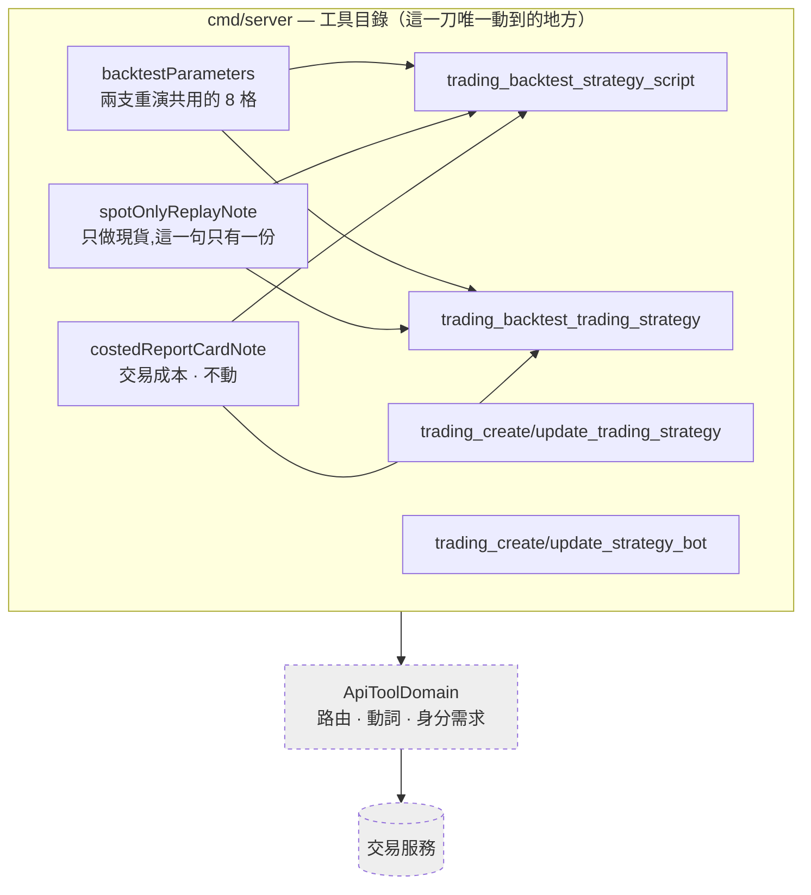

# 工具目錄只提供現貨重演 — Architecture Design

**Status:** Confirmed
**Source PRD:** `.sdd/2026-09-22-spot-only-backtest/PRD.md`
**Tech context:** Go · Clean / Onion Architecture · 工具目錄是組裝根的一部分（`cmd/server/tool_catalog*.go`）

---

## 1. Design Goal & Guiding Principle

- **In one sentence:** 把三個已經不存在的欄位與教人使用它們的整段文字，從助手看得見的那一面拿掉，
  並補上一段**說出這個服務不做什麼**的話。

- **Guiding principle:** **這一刀只動目錄，一層都不往下。**

  工具目錄是**資料**，不是邏輯：它宣告有哪些工具、每支收哪些欄位、每個欄位怎麼解釋。
  參數怎麼被送出去、回應怎麼被轉述，是 `ApiToolDomain` 與它下游的事，而那些**一行都不必動**——
  因為這一刀沒有改變任何一支工具的路由、動詞或身分需求。

  **這是判斷這一刀有沒有做對的最快方法**：如果 `internal/` 底下有任何檔案被改到，
  那就是把「目錄說什麼」與「呼叫怎麼走」混在一起了。

---

## 2. Change Scope

| Area | Action | What / Why |
| :--- | :--- | :--- |
| `cmd/server/tool_catalog.go` | **Modify** | `backtestParameters()` 刪掉 `leverage` 與 `maintenanceMarginRate` 兩格；`entryCostPercentage` 的說明改回照押注金額收 |
| `cmd/server/tool_catalog_strategy.go` | **Modify** | 兩支寫入工具刪掉 `tradingMode` 一格；重演一支策略腳本刪掉它自己的 `tradingMode` 一格；刪掉 `liquidationReportCardNote`；兩支重演的說明改寫成「只做現貨」 |
| `cmd/server/tool_catalog_automation.go` | **Modify** | 建議部位那一格的說明刪掉槓桿那一項與整段挑模式的指引 |
| `cmd/server/tool_catalog_test.go` | **Modify** | 改成驗「那三格不在」「說明說出只做現貨」 |
| `.sdd/UL-MAP.md` | **Modify** | 刪掉槓桿倍數與強平出場筆數兩列；新增「重演」一列說明它只做現貨 |
| **`internal/` 全部** | **Not touched** | 路由、動詞、身分需求、參數怎麼送、回應怎麼轉述——一行都不動。這一刀沒有改變任何一支工具**做什麼**，只改變它**說什麼、收什麼** |
| `cmd/server/tool_catalog_market.go` | **Not touched** | 行情那一組與重演無關 |
| 止損／止盈、交易成本、倉位大小模式 | **Not touched** | 現貨一樣用得到 |

---

## 3. New Classes / Modules

**無。** 這一刀不新增任何型別。

它移除的是**資料**（三個 `ToolParameterVo`）與**文字**（幾段說明字串），
新增的也是文字。宣告一個新的 model 來承載「這個服務只做現貨」這句話，
會把一句給人讀的話變成一個要被組裝的物件——而它只有一個讀者、一個出現位置。

唯一接近「新東西」的是一個共用的字串常數（見 §4 的 `spotOnlyReplayNote`），
它取代被刪掉的 `liquidationReportCardNote`，佔的是同一個位置、理由也相同：
**兩支重演工具必須對助手講同一句話**，而兩份拷貝會在第一次有人改善措辭時分岔。

---

## 4. Modified Components

| Component | Current role | Change needed |
| :--- | :--- | :--- |
| `backtestParameters()` (`tool_catalog.go`) | 兩支重演共用的參數清單 | 從 10 格變 8 格：`leverage`、`maintenanceMarginRate` 移除 |
| `entryCostPercentage` 的說明 | 說它照曝險金額收、槓桿會放大它 | 改成照**押下去的金額**收；刪掉倍數那一句 |
| `liquidationReportCardNote` (`tool_catalog_strategy.go`) | 兩支重演共用的「成績單多一格強平」說明 | **刪除**，位置由 `spotOnlyReplayNote` 接手 |
| `spotOnlyReplayNote` | — | **新增**（字串常數）：重演只做現貨、倉位怎麼走、這裡做不到什麼、遇到那種要求怎麼回。兩支重演共用 |
| `tradingStrategyWriteParameters()` | 建立／修改交易策略的參數清單 | 刪掉 `tradingMode` 一格與它那一整段（約 30 行說明） |
| `trading_backtest_strategy_script` 的說明與參數 | 重演一支策略腳本 | 刪掉它自己的 `tradingMode` 一格；說明末尾接 `spotOnlyReplayNote` |
| `trading_backtest_trading_strategy` 的說明 | 重演一份交易策略 | 刪掉整段「要改的是那一份的 tradingMode」的指引；說明末尾接 `spotOnlyReplayNote` |
| `strategyBotWriteParameters()` (`tool_catalog_automation.go`) | 建立／修改機器人的參數清單 | 建議部位那一格的說明：形狀去掉 `leverage`、刪掉整段挑模式的指引 |
| `costedReportCardNote` | 交易成本那一段共用說明 | **不動**——交易成本照舊 |

---

## 5. Component Relationships

虛線的兩個**一行都不動**——這一刀沒有改變任何一支工具做什麼。

---

## 6. Extensibility & Handoff Notes

- **Most likely next requirement:** **合約重演的工具。**
  交易服務那邊會另開一條線（自己的行情、自己的價格基準、自己的借錢成本）。

- **Where it lands:** 那是**新增一支工具**，不是把這幾格加回來。
  它會有自己的參數清單與自己的說明——正如合約 K 線在交易服務那邊是獨立的一條線，
  而不是現貨 K 線多一個開關。

- **How to add it:** 在 `tool_catalog_strategy.go` 旁邊加它自己的 `backtestContractParameters()`，
  與 `backtestParameters()` **並排**。共用的只有那些與規則無關的東西（起訖、資金、倉位大小）。
  **不要**把 `leverage` 加回 `backtestParameters()`——那一格一旦回去，
  現貨那兩支工具就又開始提供一件它們做不到的事。

- **Patterns applied & why:**
  - **共用的一句話只有一份**（`spotOnlyReplayNote`）：兩支重演對助手講的必須是同一句，
    而兩份拷貝會在第一次有人改善措辭時分岔。這是被它取代的 `liquidationReportCardNote`
    存在的理由，一字不改地繼承過來。
  - **目錄是資料**：這一刀不新增型別，因為它移除的與新增的都是資料。

- **Do not hardcode:** 「這個服務只做現貨」這句話只能有一份，寫在 `spotOnlyReplayNote` 裡。
  兩支重演各自寫一次，就是兩句等著分岔的話。

- **Known debt / deferred:**
  - **這份目錄與交易服務之間沒有版本協商。** 兩邊先後改都不會壞，
    只會在那段期間給出過期的建議。要真正解決得讓目錄從服務端生成，
    而那是比這一刀大得多的一件事，**現在不做**。
    **重新考慮它的訊號**：第三次出現「服務改了但目錄沒跟上」。

---

## 7. Traceability

| PRD Scenario | Fulfilled by |
| :--- | :--- |
| US-01 建立交易策略的工具沒有這一格 | `tradingStrategyWriteParameters()`（`tradingMode` 移除） |
| US-01 修改交易策略的工具與建立那一支一致 | 同上（兩支共用同一個參數清單函式） |
| US-01 重演一支策略腳本的工具沒有這一格 | `trading_backtest_strategy_script` 的參數（自有的 `tradingMode` 移除） |
| US-02 重演一支策略腳本不再問借幾倍 | `backtestParameters()`（`leverage`、`maintenanceMarginRate` 移除） |
| US-02 重演一份交易策略不再問借幾倍 | 同上（兩支共用） |
| US-02 機器人的建議部位剩四樣 | `strategyBotWriteParameters()` 的 `positionPlan` 說明 |
| US-02 修改機器人與建立那一支一致 | 同上（兩支共用同一個參數清單函式） |
| US-03 目錄說出重演怎麼走倉位 | `spotOnlyReplayNote` |
| US-03 目錄說出這裡做不到什麼 | `spotOnlyReplayNote` |
| US-03 目錄說出遇到那種要求該怎麼回 | `spotOnlyReplayNote` |
| US-03 舊的挑模式指引整段不見 | `tool_catalog_strategy.go`／`tool_catalog_automation.go`（整段刪除） |
| US-04 不再提那一格已經不存在的數字 | `liquidationReportCardNote` 刪除 |
| US-04 還在的那幾格照舊被提到 | `costedReportCardNote`（不動）；止損出場那一段（不動） |
| US-04 進場成本照押下去的金額收 | `entryCostPercentage` 的說明 |
| US-05 工具一支都沒少 | 無元件——這一刀不碰任何一個 `NewApiToolDomain` 的名稱、動詞或路由 |
| US-05 無關的工具逐字不變 | 無元件——`tool_catalog_market.go` 與 `internal/` 未改動 |

---

## 8. Risks & Open Decisions

### Risks / trade-offs

- **這一刀改的全是給助手讀的散文，而散文沒有型別可以檢查。**
  唯一的防線是測試去斷言「那三格不在」「這幾句話在」。
  所以測試以**缺席**為斷言對象——這正是上一輪在交易服務那邊漏掉的那種錯：
  斷言被**移除**而不是被**反轉**，於是它沉默地不再過問。

- **助手的舊對話脈絡仍可能送來那三個欄位。** 接受：服務端會拒絕並說出理由。
  這個外掛刻意不再擋一次（PRD R4）。

### Open decisions (for implementation)

- **`spotOnlyReplayNote` 要不要也接到機器人那兩支工具上？**
  建議**不要**。機器人不重演，它的建議部位只是四個數字；
  那一格的說明自己講清楚沒有槓桿就夠了。接上去會讓一段講重演的話出現在一個不重演的地方。
