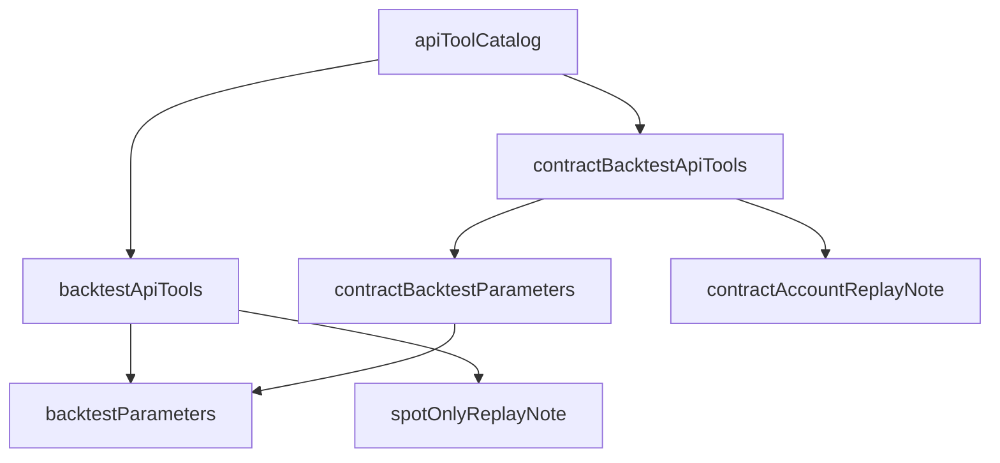

# 助理重演得了合約帳戶 — Architecture Design

**Status:** Confirmed（使用者授權一律採 best practice）
**Source PRD:** `.sdd/2026-09-23-contract-backtest/PRD.md`
**Tech context:** Go · MCP · 能力清單即功能（`cmd/server/tool_catalog*.go` 的宣告），轉達路徑不動

---

## 1. Design Goal & Guiding Principle

- **In one sentence:** 在能力清單補兩件合約重演、替交易策略兩件寫入能力補兩格，並把兩段已經不對的說明改對。
- **Guiding principle:** **宣告即功能，說明只寫一份。** 轉達路徑（`ApiToolDomain.BuildRequest`）對任何一件能力都一樣，
  所以這一刀只動宣告：合約重演的條件清單由現貨那一份延伸（`backtestParameters()` + 槓桿 + 滑點），
  合約帳戶的說法是一個共用常數，兩件合約重演讀同一份。

## 2. Change Scope

| Area | Action | What / Why |
| :--- | :--- | :--- |
| `cmd/server/tool_catalog_strategy.go` | **Modify** | 新增 `contractBacktestParameters()`、`contractAccountReplayNote`、`contractBacktestApiTools()`；`tradingStrategyWriteParameters()` 多 `marketDataKind`、`tradingMode`；改寫 `spotOnlyReplayNote` 與 `contractKCandleScriptNote` 的最後一段 |
| `cmd/server/tool_catalog.go` | **Modify** | `apiToolCatalog` 登錄合約重演兩件；`backtestParameters` 註解改寫（它仍然沒有模式與槓桿，合約那一份延伸它） |
| `cmd/server/tool_catalog_automation.go` | **Modify** | 建立／修改機器人的 `tradingStrategyId` 說明寫出只能掛 K 線交易策略 |
| `cmd/server/*_test.go` | **Modify / Add** | 清單全集多兩件；交易模式的缺席斷言只留現貨重演；合約重演的轉達與說明斷言 |
| `README.md` | **Modify** | 合約那一節改寫：重演與交易策略吃得到合約行情，機器人還不行 |
| `internal/**` | **Not touched** | 轉達路徑對任何宣告都一樣，不需要新 domain、service、proxy |

## 3. New Classes / Modules

| Name | Kind | Responsibility | Satisfies |
| :--- | :--- | :--- | :--- |
| `contractBacktestParameters()` | 宣告函式 | 兩件合約重演共用的條件：現貨那一份，加 `leverage`、`slippagePercentage` | US-01、US-02 |
| `contractAccountReplayNote` | 說明常數 | 合約帳戶怎麼算、會被拒絕的情況、怎麼讀合約成績單——只寫一份 | US-01 #5、US-02 |
| `contractBacktestApiTools()` | 宣告函式 | `trading_backtest_contract_strategy_script`（`POST /contract-backtests`，多 `strategyScriptId`／`script`／`parameters`／`aggregationInterval`／`parameterValues`／`tradingMode`）與 `trading_backtest_contract_trading_strategy`（`POST /trading-strategies/{id}/contract-backtests`，沒有 `tradingMode`） | US-01、US-02、US-04 #4 |

## 4. Modified Components

| Component | Change |
| :--- | :--- |
| `tradingStrategyWriteParameters()` | 多 `marketDataKind`（建立不給即 kCandle、修改不給即保留、不得更換）與 `tradingMode`（只給合約交易策略；三種拼法；K 線的給了會被拒絕）。**留白不送出**，由交易服務決定——與策略腳本的 `marketDataKind` 同一個做法 |
| `spotOnlyReplayNote` | 「這個服務目前不做合約」改成「這兩件只重演現貨，合約的事改用合約重演」，並寫出指名合約腳本／合約交易策略會被拒絕 |
| `contractKCandleScriptNote` 最後一段 | 改成可以拿去合約指標計算、合約重演、當合約交易策略的來源；策略機器人目前只跑 K 線 |
| 機器人的 `tradingStrategyId` | 寫出只能掛 K 線交易策略 |

## 5. Component Relationships

## 6. Extensibility & Handoff Notes

- **Most likely next requirement:** 合約的策略機器人。**Where it lands:** 機器人那兩件的說明與 `contractKCandleScriptNote` 最後一句；轉達路徑不動。
- **Do not** 把合約的格子加進 `backtestParameters()`——現貨重演收到會拒絕，一格看得見的欄位就是一格會被填的欄位。

## 7. Traceability

| PRD Scenario | Fulfilled by |
| :--- | :--- |
| US-01 全部 | `contractBacktestApiTools()` + `contractBacktestParameters()` + `contractAccountReplayNote`，轉達由既有 `BuildRequest` |
| US-02 全部 | 同上（沒有 `tradingMode` 那一格） |
| US-03 全部 | `tradingStrategyWriteParameters()` |
| US-04 全部 | `spotOnlyReplayNote`、`contractKCandleScriptNote`、`apiToolCatalog` |

## 8. Risks & Open Decisions

- 回應原樣轉達（含資金曲線），與現貨重演相同。
