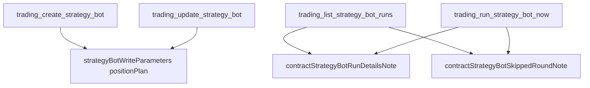

# 助理講得準合約機器人的建議部位與執行紀錄 — Architecture Design

**Status:** Confirmed
**Source PRD:** `.sdd/2026-09-24-contract-bot-run-details/PRD.md`
**Tech context:** Go · MCP server · 能力清單以 `domains.ApiToolDomain` 宣告於 `cmd/server/tool_catalog_*.go`

---

## 1. Design Goal & Guiding Principle

- **In one sentence:** 只改說明文字：部位規劃那一格寫出合約機器人照交易所規則算出的建議與新的強平警告；讀一台機器人的輪次的兩個能力多一段執行紀錄三樣新東西的說明。
- **Guiding principle:** 一段話只寫一次。讀輪次的兩個能力共用同一段（比照既有的 `contractStrategyBotSkippedRoundNote`）；建立與修改共用 `strategyBotWriteParameters()` 的部位規劃說明，本來就只有一份。

---

## 2. Change Scope

| Area | Action | What / Why |
| :--- | :--- | :--- |
| `strategyBotWriteParameters()` 的 `positionPlan` 說明 | **Modify** | 換掉「止損距離乘上槓桿達到 100% 就警告」；寫出取整、預估強平價、資金費率估算、交易所不收的三種情況與該調整什麼、還沒有交易規格時的處理 |
| `contractStrategyBotRunDetailsNote` | **Add** | 一個常數：執行紀錄的方向、槓桿、名目何時出現、開倉金額是取整後的保證金 |
| `trading_list_strategy_bot_runs`、`trading_run_strategy_bot_now` 說明 | **Modify** | 接上 `contractStrategyBotRunDetailsNote` |
| 能力名稱、輸入格子、轉送 | **Not touched** | 交易服務的輸入輸出形狀沒變 |
| 現貨的每一句 | **Not touched** | PRD 要求一字不變 |

---

## 3. New Classes / Modules

| Name | Kind | Responsibility | Collaborators | Satisfies |
| :--- | :--- | :--- | :--- | :--- |
| `contractStrategyBotRunDetailsNote` | 常數（組裝根內的說明片段） | 讓兩個讀輪次的能力說同一段關於三樣新東西的話 | 兩個能力的說明 | US-02 全部 |

---

## 4. Modified Components

| Component | Current role | Change needed |
| :--- | :--- | :--- |
| `positionPlan` 參數說明 | 說明部位規劃的形狀與規則 | 合約段落改寫為交易所規則版本 |
| 兩個讀輪次能力 | 說明輪次紀錄與跳過的輪次 | 多接一段 `contractStrategyBotRunDetailsNote` |

---

## 5. Component Relationships

---

## 6. Extensibility & Handoff Notes

- **Most likely next requirement:** 交易服務在建議裡再加一樣（例如手續費、滑點）。
- **Where it lands:** `positionPlan` 說明的合約段落；紀錄多一個欄位時，`contractStrategyBotRunDetailsNote`。
- **Do not hardcode:** 數字規則照交易服務的說法寫，不在外掛裡另算或另外驗證。
- **Known debt:** 說明是自然語言，交易服務改規則時要同步；以目錄測試釘住關鍵句。

---

## 7. Traceability

| PRD Scenario | Fulfilled by |
| :--- | :--- |
| US-01 建議部位照交易所規則算 | `positionPlan` 說明 |
| US-01 交易所不收的那一筆 | `positionPlan` 說明 |
| US-01 還沒有交易規格 | `positionPlan` 說明 |
| US-01 強平警告換成跟預估強平價比 | `positionPlan` 說明 |
| US-02 三樣新東西出現的時機 | `contractStrategyBotRunDetailsNote` |
| US-02 現貨與交易所不收的那一輪沒有 | `contractStrategyBotRunDetailsNote` |
| US-02 開倉金額是取整後的保證金 | `contractStrategyBotRunDetailsNote` |
| US-03 現貨一字不差 | 不動現貨句子；目錄測試釘住 |

---

## 8. Risks & Open Decisions

- **Risks:** 說明長度增加；條列與粗體關鍵句維持可讀。
- **Open decisions:** 無。
