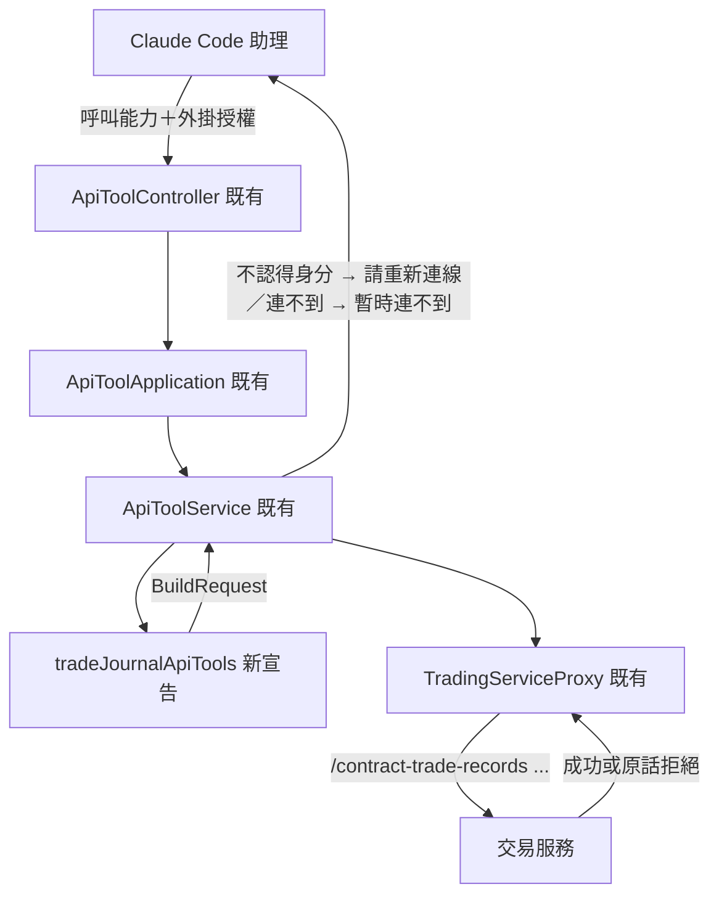

# 合約交易日誌（外掛）— Architecture Design

**Status:** Confirmed
**Source PRD:** `.sdd/2026-09-27-contract-trade-journal/PRD.md`
**Tech context:** Go · MCP 外掛 · 能力清單即功能（`cmd/server/tool_catalog*.go` 宣告，`ApiToolDomain` 單一路徑轉達）· 交易服務路由以 `go-trading/.sdd/2026-09-27-contract-trade-journal/ARCH.md` 為準

---

## 1. Design Goal & Guiding Principle

- **In one sentence:** 在能力清單新增一組「交易日誌」能力（19 個），一個能力對應交易服務一條日誌路由，讓助理代使用者記交易、加／修／刪成交、改計畫、加附註、寫檢討、貼型態標籤、列出與查看交易、看統計、看實盤 vs 回測、管理標籤與手續費率、刪除交易。
- **Guiding principle:** **能力只是宣告，規則全在交易服務。** 沿用「加第五十一個能力就是加一筆宣告」的既有做法：
  - 不新增 handler，不新增分支，`internal/` 零改動。
  - 每一條「會被拒絕的原因」寫進能力說明，讓助理先知道；外掛自己不驗證任何一條。
  - PRD 裡只能靠助理判斷的規矩也寫進能力說明，包括：先問實際成交價、刪除前先確認、一句話多筆成交依序送、時間以台北時間回報。

  外掛宣告刻意沒有「固定值／預設值」這種東西（見 `2026-09-24-contract-strategy-bots` ARCH），所以「沒說時間用現在」「列出預設 20 筆」這兩條由**交易服務**預設，外掛只在說明裡寫出「省略即是什麼」。

---

## 2. Change Scope

| Area | Action | What / Why |
| :--- | :--- | :--- |
| 新檔 `cmd/server/tool_catalog_trade_journal.go` | **Add** | `tradeJournalApiTools(replayWaitLimit)`，以及共用的參數組：`contractTradeFillParameters()`、`contractTradePlanParameters()`。日誌是交易服務的一條獨立入口群（`/contract-trade-records`、`/users/me/trade-*`），比照合約能力自成一檔 |
| `cmd/server/tool_catalog.go` `apiToolCatalog` | **Modify** | 多一行 `catalog = append(catalog, tradeJournalApiTools(replayWaitLimit)...)` |
| 新測試 `cmd/server/tool_catalog_trade_journal_test.go` | **Add** | 釘住每一條 PRD 情境對應的能力、送往哪裡、必填與選填、說明裡必須出現的句子 |
| `cmd/server/tool_catalog_test.go` | **Modify** | 若有「能力總數」或「名稱不重複」的斷言，隨之更新 |
| README 能力表 | **Modify** | 補上日誌那一組 |
| `internal/` 全部（`ApiToolService`、`ApiToolDomain`、`ToolArgumentsDomain`、`TradingServiceProxy`、`FailureReasonDomain`） | **Not touched** | 以下行為既有路徑都已具備：沒填就不送、path／query／body 分流、交易服務拒絕原話帶回、不認得身分請重新連線、連不到說暫時連不到 |
| `ReplayResultDomain` 濃縮 | **Not touched** | 實盤 vs 回測的回覆是對照表，不是重演結果全文，不濃縮 |
| 記到交易日誌連結的預填入口 | **Not touched** | 連結給操作台用；PRD 沒有要外掛打開連結 |

---

## 3. New Classes / Modules

沒有新型別。新增一份能力宣告檔與一份測試檔。能力清單如下，路由都在 `requiresSignIn` 之後，授權照既有方式帶入。

| 能力名稱 | 交易服務路由 | 參數（位置／必填） | 說明必須寫出的事 | Satisfies |
| :--- | :--- | :--- | :--- | :--- |
| `trading_record_contract_trade` | `POST /contract-trade-records` | body：`symbol`✔、`direction`✔(`long`/`short`)、`leverage`、`firstEntryFill`✔(object：`filledAt`、`price`✔、`quantity`✔、`liquidity`(`maker`/`taker`)、`fee`)、`plan`(object：`plannedStopLossPrice`、`plannedTakeProfitPrice`、`entryReason`、`confidence`(1–5))、`tradingStrategyId`、`setupTagIds`(array) | ① 成交價必須是使用者說的實際成交價，**機器人訊息的參考價不是成交價**，沒說就先問；② `filledAt` 省略即交易服務以現在記下，回覆時用台北時間（或使用者說的時區）說出記下的時間請他確認；使用者說了時間就換成 RFC3339 帶時區；③ 同標的同方向已有持倉中會被拒絕並給出那一筆的編號，改用加成交；④ 槓桿留白即一倍、小於一被拒絕；⑤ 止損止盈要在對的一邊；⑥ 只能關聯自己的**合約**交易策略；⑦ 沒有欄位可以指定擁有者 | US-01 全部、US-07「沒有欄位能指定擁有者」 |
| `trading_add_contract_trade_fill` | `POST /contract-trade-records/{id}/fills` | path `id`；body：成交參數組（`kind`✔ `entry`/`exit`、`filledAt`、`price`✔、`quantity`✔、`liquidity`、`fee`） | 出場超過持倉被拒絕（要反手請先平倉再新增一筆）；持倉歸零即平倉，回覆後提醒可以寫檢討；已平倉不能再加；一句話說了多筆成交時依序一筆一筆送，中途被拒就停下帶回原因 | US-02 加碼、全部平倉、出場超過持倉 |
| `trading_update_contract_trade_fill` | `PUT /contract-trade-records/{id}/fills/{fillId}` | path `id`、`fillId`；body：成交參數組 | 只有持倉中的交易可以修正；平倉後成交已鎖定，只能加附註或刪除整筆重記 | US-02 修正成交、平倉後成交鎖定 |
| `trading_remove_contract_trade_fill` | `DELETE /contract-trade-records/{id}/fills/{fillId}` | path `id`、`fillId` | 持倉中才可刪；不能刪到沒有進場成交（要整筆放棄請刪除交易） | US-02 刪除成交 |
| `trading_update_contract_trade_plan` | `PUT /contract-trade-records/{id}/plan` | path `id`；body：計畫參數組（`plannedStopLossPrice`、`plannedTakeProfitPrice`、`entryReason`、`confidence`） | 平倉後計畫已鎖定，被拒時建議改成加附註 | US-03 修改計畫、平倉後修改被拒 |
| `trading_add_contract_trade_note` | `POST /contract-trade-records/{id}/notes` | path `id`；body `content`✔ | 任何狀態都能加；附註不會改動原本的計畫 | US-03 加附註 |
| `trading_write_contract_trade_review` | `PUT /contract-trade-records/{id}/review` | path `id`；body：`wentWell`、`wentWrong`、`nextTime`、`executionScore`✔(1–5)、`mistakeTagIds`(array) | 只能在平倉後寫；寫完即已檢討，之後還能改；失誤標籤用標籤編號，不知道編號時先列出標籤 | US-03 口述檢討、持倉中被拒 |
| `trading_set_contract_trade_setup_tags` | `PUT /contract-trade-records/{id}/setup-tags` | path `id`；body `setupTagIds`✔(array) | 整組取代；空陣列即全部拿掉 | US-05 新增型態標籤（貼上那一步） |
| `trading_list_contract_trades` | `GET /contract-trade-records` | query：`status`(`open`/`closed`/`reviewed`)、`symbol`、`period`(`7d`/`30d`/`90d`/`all`，以第一筆進場時間篩選，省略即不限)、`limit` | 省略 `limit` 即最近 20 筆（依第一筆進場時間由新到舊），使用者指定筆數才填；回覆時說出總數；「待檢討」＝`status=closed` | US-04 列出待檢討、預設 20 筆、指定幾筆 |
| `trading_get_contract_trade` | `GET /contract-trade-records/{id}` | path `id` | 回覆裡「算不出／無法計算／估算」的項目照交易服務的說法帶回，**不要說成 0**；別人的交易會是找不到 | US-04 算不出的照原話、別人的交易 |
| `trading_delete_contract_trade` | `DELETE /contract-trade-records/{id}` | path `id` | **刪除前必須先向使用者確認是哪一筆**（說出標的、方向、編號），使用者說「刪掉 BTC 那筆」但有多筆時先列出請他指定，不要猜；成交、附註、檢討會一併刪除 | US-06 全部 |
| `trading_get_contract_trade_statistics` | `GET /contract-trade-records/statistics` | query `period`(`7d`/`30d`/`90d`/`all`) | 省略即最近 30 天；只計期間內平倉的；沒有已平倉交易時勝率是不適用，不是 0%；沒設止損的交易不計入 R 相關數字 | US-04 看統計、沒說期間、期間內沒有 |
| `trading_compare_contract_trades_with_backtest` | `GET /trading-strategies/{id}/contract-trade-comparison` | path `id`（合約交易策略） | 會替每個標的重演一次，需要時間；某一列重演失敗時實盤照常、回測欄說原因；策略已刪除時說無法重演 | US-04 看實盤 vs 回測 |
| `trading_get_trade_journal_settings` | `GET /users/me/trade-journal-settings` | — | 回覆掛單與吃單費率；沒設定時說未設定 | US-05 設定／修正費率（查看） |
| `trading_save_trade_journal_settings` | `PUT /users/me/trade-journal-settings` | body：`makerFeeRate`、`takerFeeRate`（百分比字串） | 不得為負；改了只影響之後記的成交，舊成交的手續費不變 | US-05 設定、修正、費率為負 |
| `trading_list_trade_tags` | `GET /users/me/trade-tags` | — | 失誤標籤與型態標籤兩類；一開始就有五個預設失誤標籤 | US-05（取得標籤編號） |
| `trading_create_trade_tag` | `POST /users/me/trade-tags` | body：`kind`✔(`mistake`/`setup`)、`name`✔ | 同一類不能重名，不同類可以 | US-05 新增型態標籤、重名被拒 |
| `trading_rename_trade_tag` | `PUT /users/me/trade-tags/{id}` | path `id`；body `name`✔ | 貼著它的交易跟著改名 | US-05 改名 |
| `trading_delete_trade_tag` | `DELETE /users/me/trade-tags/{id}` | path `id` | 還貼在交易上的標籤不能刪，被拒時說出還有幾筆，建議先移除或改名 | US-05 使用中刪除被拒 |

實盤 vs 回測加上 `.Waiting(replayWaitLimit)`，比照既有重演能力，避免把「重演中」誤報成連不到交易服務。其餘能力都用一般等待時間。

---

## 4. Modified Components

| Component | Current role | Change needed |
| :--- | :--- | :--- |
| `apiToolCatalog` | 組出整份能力清單 | 多加 `tradeJournalApiTools(replayWaitLimit)` 一組 |
| `tool_catalog_test.go` | 整份清單的共通斷言 | 若有總數或逐一列名斷言，隨之更新 |

---

## 5. Component Relationships

---

## 6. Extensibility & Handoff Notes

- **Most likely next requirement:** 現貨交易日誌（交易服務另開 `spot-trade-records` 入口群）。
- **Where it lands:** 另開一檔宣告現貨那一組能力，名稱帶 `spot`。不要把 `contract` 能力改成吃「市場種類」一格，因為交易服務是兩組入口，外掛照入口決定形狀。
- **How to add it:** 複製 `tool_catalog_trade_journal.go` 的結構，拿掉槓桿、方向、資金費用相關說明，在 `apiToolCatalog` 加一行。成交與標籤參數組若兩邊相同就共用。
- **Second likely:** 交易服務為日誌新增欄位或路由（例如依型態標籤篩選）。在對應能力加一格參數、或加一筆宣告，外掛本身沒有其他地方要動。
- **Patterns applied & why:** 能力宣告即功能（既有）；共用參數組（成交、計畫各一組），讓新增與修正讀同一份，避免一份多一格、另一份少一格（比照 `kCandlePriceParameters`）。
- **Do not hardcode:** 外掛不寫預設值、不驗證值、不重算任何數字，全部交給交易服務；說明裡提到的預設（20 筆、30 天、現在時刻）必須與交易服務的實際預設一致，改了要一起改。
- **Known debt / deferred:** 能力說明文字是助理行為的唯一約束，無法保證助理一定先確認才刪除。這是 PRD 接受的限制，交易服務本身不需要確認步驟。

---

## 7. Traceability

| PRD Scenario | Fulfilled by |
| :--- | :--- |
| US-01 口述記一筆 | `trading_record_contract_trade`（回覆由交易服務的交易內容帶出編號、均價、計畫風險、成交時間） |
| US-01 沒說成交時間以現在為準 | `trading_record_contract_trade` 的 `filledAt` 選填＋說明（台北時間回報）＋**交易服務省略即現在**（跨 repo 依賴，見 §8） |
| US-01 說了成交時間就照他說的 | `filledAt` 說明：RFC3339 帶時區 |
| US-01 只貼機器人訊息不當成成交 | `trading_record_contract_trade` 與成交參數組 `price` 的說明：參考價不是成交價，先問 |
| US-01 同標的同方向已有持倉中 | 交易服務拒絕原話帶回（既有路徑）＋說明：改用 `trading_add_contract_trade_fill` |
| US-01 關聯自己的合約交易策略 | `tradingStrategyId` 參數與說明 |
| US-01 交易服務拒絕時原話帶回 | 既有 `ApiToolDomain.Relayed`，拒絕原話 |
| US-02 加碼／全部平倉／出場超過持倉 | `trading_add_contract_trade_fill` |
| US-02 持倉中修正打錯的成交 | `trading_update_contract_trade_fill` |
| US-02 持倉中刪除一筆記錯的成交 | `trading_remove_contract_trade_fill` |
| US-02 平倉後成交鎖定 | 交易服務拒絕原話＋`trading_update_contract_trade_fill` 說明 |
| US-03 持倉中修改計畫／平倉後修改計畫被拒 | `trading_update_contract_trade_plan` |
| US-03 加附註 | `trading_add_contract_trade_note` |
| US-03 口述檢討／持倉中寫檢討被拒 | `trading_write_contract_trade_review` |
| US-04 列出待檢討的交易 | `trading_list_contract_trades` 的 `status=closed` |
| US-04 列出交易預設最近 20 筆／指定要幾筆 | `trading_list_contract_trades` 的 `limit` 選填＋**交易服務預設 20**（跨 repo 依賴，見 §8） |
| US-04 算不出的數字照原話帶回 | `trading_get_contract_trade` 說明＋外掛原樣轉交 |
| US-04 看統計／沒說期間就看最近 30 天／期間內沒有已平倉交易 | `trading_get_contract_trade_statistics`（交易服務預設 30 天，已在後端 ARCH） |
| US-04 看實盤 vs 回測 | `trading_compare_contract_trades_with_backtest`（`.Waiting`） |
| US-04 別人的交易 | 交易服務「找不到」原話帶回 |
| US-05 設定手續費率／修正手續費率／費率為負被拒 | `trading_save_trade_journal_settings`（＋`trading_get_trade_journal_settings`） |
| US-05 新增型態標籤／標籤重名被拒 | `trading_create_trade_tag`＋`trading_set_contract_trade_setup_tags` |
| US-05 標籤改名 | `trading_rename_trade_tag` |
| US-05 使用中的標籤刪除被拒 | `trading_delete_trade_tag`＋拒絕原話 |
| US-06 確認後刪除／指的不只一筆時不猜／未確認不刪 | `trading_delete_contract_trade` 說明（先確認、多筆先列出） |
| US-07 沒有欄位能指定擁有者 | 所有日誌能力都沒有擁有者參數；身分只來自外掛授權（既有） |
| US-07 交易服務不認得身分 | 既有 `ApiToolService`：`TradingServiceIdentityNotRecognized` 對應 `ErrReconnectRequired` |
| US-07 連不到交易服務 | 既有 `FailureReasonDomain` |

---

## 8. Risks & Open Decisions

- **Risks / trade-offs:**
  - 助理行為規矩（先問成交價、先確認再刪、依序送多筆、時區回報）只能寫在說明裡，外掛擋不住。這符合外掛「只說明、不驗證」的原則；測試只能釘住說明裡有那句話。
  - `firstEntryFill` 用巢狀物件，前提是交易服務的新增請求真的是這個形狀。實作前要以後端的 request model 為準，名稱不一致就照後端改。
- **跨 repo 依賴（需回寫後端 ARCH／實作）：**
  1. **成交時間省略即現在**：後端 `ContractTradeFillWriteDto.FilledAt` 須為選填，省略時由交易服務以 `IClockProxy.Now()` 記下，回覆帶出實際記下的時刻。外掛宣告沒有預設值，無法替助理填「現在」。
  2. **列出交易預設 20 筆**：後端 ARCH 目前寫「預設 50、最多 200（TBD）」。MCP PRD 要 20，建議後端預設改為 20（前端要更多時自行帶 `limit`）；否則就改 MCP PRD 與說明。
- **Open decisions (for implementation):**
  - 百分比欄位（費率）與價格欄位一律以字串形式的精確小數傳遞，比照既有能力。
  - 回覆的時間是交易服務給的世界標準時間，由助理換算成台北時間；外掛不轉換。
