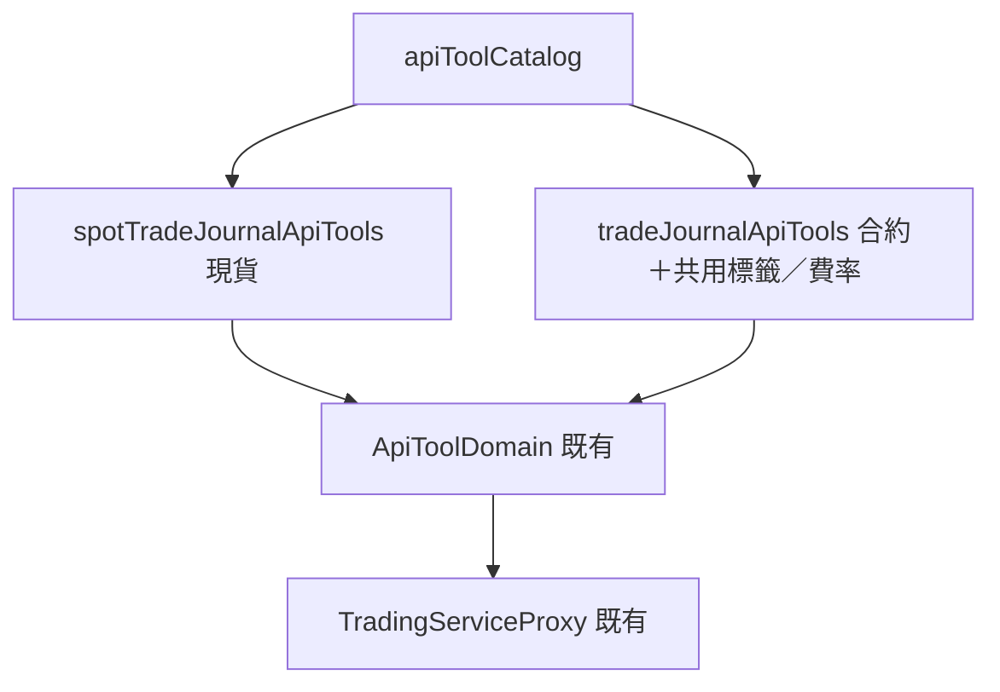

# 現貨交易日誌（外掛）— Architecture Design

**Status:** Confirmed
**Source PRD:** `.sdd/2026-09-27-spot-trade-journal/PRD.md`
**Tech context:** Go · MCP 外掛 · 能力清單即功能（`cmd/server/tool_catalog*.go` 宣告，`ApiToolDomain` 單一路徑轉達）· 交易服務路由以 `go-trading/.sdd/2026-09-27-spot-trade-journal/ARCH.md`（與其 API 契約整理）為準

---

## 1. Design Goal & Guiding Principle

- **In one sentence:** 在能力清單新增一組 13 個「現貨交易日誌」能力，一個能力對應交易服務一條 `/spot-trade-records` 路由；並把合約日誌能力的說明改成開倉／加倉／減倉／平倉的說法。
- **Guiding principle:** 沿用合約日誌建立的「**能力只是宣告，規則全在交易服務**」：
  - 現貨另開一份宣告檔，**不在合約能力上加市場參數**——與交易服務「現貨與合約各走各的線」一致，兩組能力的說明各自講自己那本的規則。
  - `internal/` 零改動；沒填就不送、拒絕原話帶回、請重新連線、暫時連不到都是既有路徑。
  - 只能靠助理判斷的規矩（一張換算、同代號先問、現貨沒有做空與槓桿、手續費沒說即 0、整份取代先讀再帶）寫進能力說明。

---

## 2. Change Scope

| Area | Action | What / Why |
| :--- | :--- | :--- |
| 新檔 `cmd/server/tool_catalog_spot_trade_journal.go` | **Add** | `spotTradeJournalApiTools(replayWaitLimit)` 與共用參數組 `spotTradeFillParameters()`、`spotTradePlanParameters()` |
| `cmd/server/tool_catalog.go` `apiToolCatalog` | **Modify** | 多一行把現貨那一組加進清單 |
| `cmd/server/tool_catalog_trade_journal.go` | **Modify** | 合約能力說明改用開倉／加倉／減倉／平倉與開倉價／平倉價，拿掉「成交」「成交價」；第一筆沒標 `kind` 時交易服務當作開倉，說明不再宣稱會被拒絕；標籤能力說明補「兩本共用」、手續費率能力補「只用於合約日誌」 |
| 新測試 `cmd/server/tool_catalog_spot_trade_journal_test.go` | **Add** | 釘住每一條 PRD 情境對應的能力、送往哪裡、必填、說明必須出現的句子 |
| `cmd/server/tool_catalog_trade_journal_test.go` | **Modify** | 用語斷言改為開倉／平倉；新增「合約說明不出現成交」 |
| `cmd/server/tool_catalog_test.go` 能力全集 | **Modify** | 補 13 個現貨能力名 |
| README | **Modify** | 新增〈現貨交易日誌〉一節，合約一節改用語 |
| `internal/` 全部 | **Not touched** | 既有路徑已足夠 |
| 記到交易日誌連結預填 | **Not touched** | 操作台的事 |

---

## 3. New Classes / Modules

沒有新型別，只有一份宣告檔與一份測試檔。

| 能力名稱 | 交易服務路由 | 參數（✔ 必填） | 說明必須寫出的事 | Satisfies |
| :--- | :--- | :--- | :--- | :--- |
| `trading_record_spot_trade` | `POST /spot-trade-records` | body：`symbol`✔、`firstBuyFill`✔(object：`kind`(`buy`)、`filledAt`、`price`✔、`quantity`✔、`fee`)、`plan`(object)、`tradingStrategyId`、`setupTagIds` | 現貨只有先買後賣、沒有槓桿與做空（說了就說明後不送）；價格必須是使用者說的實際價格（參考價不是）；台股整數股、一張＝1,000 股並說出來確認；手續費沒說即 0、台股證交稅併入；BTCUSDT 這類同代號先問現貨或合約；同標的已有持有中會被拒絕並給出編號，改加買進；只能關聯自己的 K 線交易策略；時間省略即現在並以台北時間回報；回覆說出編號；沒有欄位可以指定擁有者 | US-01、US-07 |
| `trading_add_spot_trade_fill` | `POST /spot-trade-records/{id}/fills` | path `id`；body：買賣參數組（`kind`✔ `buy`/`sell`、`filledAt`、`price`✔、`quantity`✔、`fee`） | 賣出超過持有被拒絕；全部賣出即平倉，回覆淨損益與報酬率並提醒寫檢討；已平倉不能再加；台股整數股；手續費沒說即 0，台股賣出提醒證交稅 | US-02 |
| `trading_update_spot_trade_fill` | `PUT /spot-trade-records/{id}/fills/{fillId}` | path `id`、`fillId`；body：買賣參數組 | 整筆取代，先讀出再帶上；只有持有中可修正；平倉後只能加附註或刪除整筆重記 | US-02 修正 |
| `trading_remove_spot_trade_fill` | `DELETE /spot-trade-records/{id}/fills/{fillId}` | path | 持有中才可刪；不能刪到沒有買進 | US-02 |
| `trading_update_spot_trade_plan` | `PUT /spot-trade-records/{id}/plan` | path `id`；body：計畫參數組 | 止損必須低於買進價、止盈高於；整份取代先讀再帶；平倉後鎖定改加附註 | US-03 |
| `trading_add_spot_trade_note` | `POST /spot-trade-records/{id}/notes` | `id`、`content`✔ | 任何狀態都能加；不改原計畫 | US-03 |
| `trading_write_spot_trade_review` | `PUT /spot-trade-records/{id}/review` | `id`、`executionScore`✔、`wentWell`、`wentWrong`、`nextTime`、`mistakeTagIds` | 平倉後才可寫；整份取代先讀再帶；標籤與合約共用 | US-03 |
| `trading_set_spot_trade_setup_tags` | `PUT /spot-trade-records/{id}/setup-tags` | `id`、`setupTagIds`✔ | 整組取代；空陣列即全部拿掉 | US-03 |
| `trading_list_spot_trades` | `GET /spot-trade-records` | query：`status`、`symbol`、`market`(`taiwanStock`/`crypto`)、`period`、`limit` | 省略 limit 即最近 20 筆；說出總數；待檢討＝closed；可依市場篩選 | US-04 |
| `trading_get_spot_trade` | `GET /spot-trade-records/{id}` | `id` | 算不出不說成 0；現貨沒有資金費用與強平價；浮動損益是估算 | US-04 |
| `trading_delete_spot_trade` | `DELETE /spot-trade-records/{id}` | `id` | 刪除前確認是哪一筆；多筆時列出請指定 | US-06 |
| `trading_get_spot_trade_statistics` | `GET /spot-trade-records/statistics` | query `period` | 省略即最近 30 天；台股與加密貨幣兩組分開、金額不跨幣別加總；平均 R 只用有止損的筆數並說出幾筆；沒有已平倉時勝率不適用 | US-04 |
| `trading_compare_spot_trades_with_backtest` | `GET /trading-strategies/{id}/spot-trade-comparison` | path `id`（K 線交易策略） | 需要時間；重演不計成本；實盤照常；逾時不要立刻重送 | US-04 |

---

## 4. Modified Components

| Component | Current role | Change needed |
| :--- | :--- | :--- |
| `tradeJournalApiTools` 合約能力說明 | 說「成交」「成交價」「進場均價」 | 改說開倉／加倉／減倉／平倉、開倉價／平倉價、開倉均價；`firstEntryFill` 的 `kind` 改為選填說明（省略即開倉） |
| 標籤與手續費率能力 | 只提合約 | 標籤說明「兩本日誌共用」；手續費率說明「只用於合約日誌，現貨手續費每筆自己填」 |
| `apiToolCatalog` | 組清單 | 加入 `spotTradeJournalApiTools` |

---

## 5. Component Relationships

---

## 6. Extensibility & Handoff Notes

- **Most likely next requirement:** 現貨手續費率自動帶出，或新增一種市場（例如美股）。
- **Where it lands:** 費率是交易服務的事，外掛只在 `spotTradeFillParameters` 的 `fee` 說明改一句；新市場只要交易服務認得標的，外掛不必改（`market` 篩選說明補一個值）。
- **Do not hardcode:** 外掛不帶任何預設值（時間、筆數、期間都由交易服務預設，說明只寫出「省略即是什麼」）。
- **Known debt:** 能力說明很長，是把規則交給助理的唯一管道；若清單規模再大，考慮把共通規矩抽成共用常數（本次已抽買賣與計畫參數組）。

---

## 7. Traceability

| PRD Scenario | Fulfilled by |
| :--- | :--- |
| US-01 口述一張台股／口述加密貨幣現貨／沒說時間 | `trading_record_spot_trade`（說明：一張換算、時間省略即現在） |
| US-01 現貨沒有做空／沒有槓桿／同代號先問／只貼機器人訊息 | `trading_record_spot_trade` 說明 |
| US-01 同一標的已有持有中 | 交易服務拒絕＋`trading_record_spot_trade` 說明指向 `trading_add_spot_trade_fill` |
| US-02 分批賣出／全部賣出即平倉／賣出超過持有／整數股／手續費 0／含稅手續費 | `trading_add_spot_trade_fill` |
| US-02 修正持有中的買賣／平倉後不能修正 | `trading_update_spot_trade_fill` |
| US-03 止損低於買進價／只改一項／平倉後鎖定 | `trading_update_spot_trade_plan` |
| US-03 平倉後寫檢討 | `trading_write_spot_trade_review` |
| US-04 統計分組／平均 R 筆數／期間內沒有平倉 | `trading_get_spot_trade_statistics` |
| US-04 查看持有中 | `trading_get_spot_trade` |
| US-04 現貨實盤 vs 回測 | `trading_compare_spot_trades_with_backtest` |
| US-04 依市場篩選 | `trading_list_spot_trades` 的 `market` |
| US-05 加倉／減倉與平倉／不再出現成交 | `tradeJournalApiTools` 說明改寫 |
| US-06 確認後刪除／多筆先問 | `trading_delete_spot_trade` |
| US-07 拒絕原話帶回／別人的交易／沒有欄位指定擁有者 | 既有 `ApiToolDomain` 路徑＋無 owner 參數 |

---

## 8. Risks & Open Decisions

- **Risks:** 交易服務現貨切片與本切片同時開發，路由與欄位以其 API 契約整理為準；若實作有出入需回頭對齊。
- **Open decisions:** 無。
